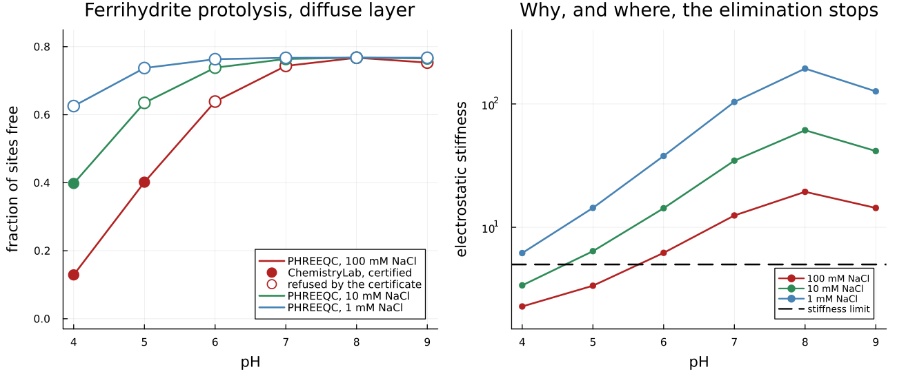

# [A charged surface, screened](@id sec-example-diffuse-layer)

[The zinc edge](@ref sec-example-hfo) ran with the electrostatics switched off,
and said in a box that the published Dzombak & Morel constants were therefore
being used outside the model they were fitted in. This page closes that gap for
the acid-base half of the problem, and is equally explicit about the half it
does not close.

An oxide surface that binds protons becomes **charged**, and a charged surface
is surrounded by a cloud of counter-ions that screens it. How well it is
screened depends on how many ions the solution has to spare — so unlike every
other quantity on these pages, the answer depends on the **background
electrolyte**, and that dependence is the whole content of the model.

## The experiment

Ferrihydrite's weak sites at Dzombak & Morel's own density — 2.0 × 10⁻⁴ mol of
sites on 53.4 m², which is 2.25 sites per square nanometer — titrated from pH 4
to pH 9 in sodium chloride, at three concentrations two decades apart.

!!! note "A site density is not a free parameter here"
    A surface a thousand times more dilute carries a thousandth of the charge
    per unit area, raises a potential of a few millivolts, and would let a model
    that did nothing at all pass for one that worked. The first draft of this
    comparison made exactly that mistake and reported agreement.

```@example ddl
using ChemistryLab, DynamicQuantities, SciMLBase, OptimaSolver

const RT = R_GAS * 298.15
g0(v) = SymbolicFunc(v * u"J/mol")

# The aqueous species come from a database the package ships, not from numbers
# typed here — see [Where the numbers come from](@ref sec-manual-numbers).
const DB = Dict(symbol(s) => s for s in
                build_species(datapath("slop98-inorganic-thermofun.json"); verbose = false))

const AREA    = 53.4          # m², the support that carries the sites
const N_SITES = 2.0e-4        # mol
const LOGK    = (protonation = 7.29, deprotonation = -8.93)   # PHREEQC's own

function hfo(; m_na, m_cl, model)
    h2o, hp, oh, na, cl = (DB[k] for k in ("H2O@", "H+", "OH-", "Na+", "Cl-"))

    free = Species("XsOH";   aggregate_state = AS_SURFACE, class = SC_SURFCOMPLEX); free[:ΔₐG⁰] = g0(0.0)
    prot = Species("XsOH2+"; aggregate_state = AS_SURFACE, class = SC_SURFCOMPLEX)
    prot[:ΔₐG⁰] = g0(-RT * log(10.0^LOGK.protonation))
    depr = Species("XsO-";   aggregate_state = AS_SURFACE, class = SC_SURFCOMPLEX)
    depr[:ΔₐG⁰] = g0(-RT * log(10.0^LOGK.deprotonation))

    family = SiteFamily(
        "Xs", free, [prot, depr];
        capacity = TotalSiteAmount(N_SITES),
        support = SurfaceSupport("hfo", nothing, FixedSurfaceArea(AREA)),
        model,
    )
    cs = ChemicalSystem(
        [h2o, hp, oh, na, cl, free, prot, depr],
        [h2o, hp, na, cl, free]; site_families = [family],
    )
    n = Any[fill(1.0e-12u"mol", length(cs.species))...]
    n[1] = N_WATER * u"mol"; n[4] = m_na * u"mol"; n[5] = m_cl * u"mol"; n[6] = N_SITES * u"mol"
    return cs, ChemicalState(cs, n)
end
nothing # hide
```

The only thing that changes between the three curves below is the `model`
keyword of the site family. Everything else — the constants, the budget, the
support — is shared, which is what makes them comparable.

## Three descriptions of the same surface

```@example ddl
# PHREEQC's diffuse-layer answer, from test/reference/phreeqc_hfo_surface.py.
# The ionic strength travels with each point because PHREEQC reaches its pH by
# adding HCl: at pH 4 in 0.1 M NaCl the background is 0.2 % above nominal, and
# matching it keeps this a comparison of surface models rather than of titration
# bookkeeping.
PHREEQC = [
    (pH = 4.0, I = 0.10020818821557677, free = 0.12895390976789184, prot = 0.8706085216673665, depr = 0.0004375685647416558),
    (pH = 5.0, I = 0.10007071119186411, free = 0.4015722153881447,  prot = 0.5921894793065487, depr = 0.006238305305306556),
    (pH = 6.0, I = 0.10003174586231472, free = 0.6386059912806334,  prot = 0.33336935164852766, depr = 0.02802465707083882),
    (pH = 7.0, I = 0.10001244489212303, free = 0.7434227764064236,  prot = 0.18990727435277374, depr = 0.06666994924080262),
    (pH = 8.0, I = 0.10000108069648564, free = 0.767441433793806,   prot = 0.12161144800544535, depr = 0.11094711820074868),
    (pH = 9.0, I = 0.09999058741405632, free = 0.7532292046785007,  prot = 0.07619830499014452, depr = 0.17057249033135471),
]
PHREEQC_DIFFUSE_LAYER_LIKE(pt) = N_SITES .* [pt.free, pt.prot, pt.depr]
# One kilogram of water, from the solvent's own molar mass — `55.5` weighs
# 0.99983 kg, and every molality below would carry that error.
const N_WATER = ustrip(us"mol", 1.0u"kg" / DB["H2O@"][:M])
const KGW = 1.0

function titrate(model, pt)
    m_na = 0.1 * KGW
    m_cl = (2 * pt.I - 0.1 - 10.0^(-pt.pH) - 10.0^(pt.pH - 14)) * KGW
    cs, st = hfo(; m_na, m_cl, model)
    des = DualEquilibriumSolver(cs, DiluteSolutionModel())
    b = Float64.(cs.SM.A) * Float64[ustrip(us"mol", x) for x in st.n]
    eq = SciMLBase.solve(des, st; b = b, constraint = FixedpH(pt.pH),
                         parameters = Base.RefValue{Any}(nothing))
    cert = optimality_certificate(des, eq; b = b, constraint = FixedpH(pt.pH))
    n = Float64[ustrip(us"mol", x) for x in eq.n]
    N = n[6] + n[7] + n[8]
    return (free = n[6] / N, stationarity = cert.stationarity)
end

# THE FORECAST IS MADE AT A COMPOSITION WE BELIEVE, which here is PHREEQC's.
# Asking the returned state instead is circular and, worse, flattering: a solve
# that walked off lands on a nearly fully protonated surface, where `asinh` is
# flat and the stiffness reads *low*. The first draft of this page did that and
# printed "eliminable" next to every failure.
function forecast(pt)
    n = PHREEQC_DIFFUSE_LAYER_LIKE(pt)
    return electrostatic_stiffness(DiffuseLayer(; area = AREA), [0.0, 1.0, -1.0], n,
                                   pt.I, 298.15)
end
nothing # hide
```

```@example ddl
models = (
    "no electrostatics" => IdealSiteMixing(),
    "constant capacitance, C = 1.06 F/m²" => ConstantCapacitance(; C = 1.06, area = AREA),
    "diffuse layer" => DiffuseLayer(; area = AREA),
)

for (name, model) in models
    print(rpad(name, 38))
    for pt in PHREEQC
        r = titrate(model, pt)
        print(r.stationarity < 1.0e-8 ? lpad(string(round(r.free; digits = 3)), 8) :
                                        lpad("--", 8))
    end
    println()
end
print(rpad("PHREEQC, diffuse layer", 38))
for pt in PHREEQC; print(lpad(string(round(pt.free; digits = 3)), 8)); end
println("\n", rpad("pH", 38), join(lpad(string(pt.pH), 8) for pt in PHREEQC))
```

Read the last two rows against each other. Where the diffuse-layer solve
certifies, it lands on PHREEQC's number to three decimals; where it does not, it
prints `--` rather than a number, because **the certificate refused it** and an
uncertified answer is not an answer. Nothing here chose which points to show.

The constant-capacitance row is the interesting middle. It has the right shape
and it is not PHREEQC's curve, for the honest reason that it is a different
model: 1.06 F/m² is a common value for ferrihydrite, not a screening law, and
nothing about it knows the background is 0.1 molar.

## Why it stops, and where — before you run it

```@example ddl
using Printf
println("  pH   stiffness   forecast              certificate")
for pt in PHREEQC
    r = titrate(DiffuseLayer(; area = AREA), pt)
    s = forecast(pt)
    @printf("%5.1f %10.2f   %-18s  %.1e\n", pt.pH, s,
            s < ELECTROSTATIC_STIFFNESS_LIMIT ? "eliminable" : "needs the unknown",
            r.stationarity)
end
```

[`electrostatic_stiffness`](@ref) is how strongly the surface potential reacts
to the composition that raises it — so it is a property of the **answer**, and
forecasting with it means evaluating it somewhere you already believe. Here that
is PHREEQC's answer; in a continuation it is the last step that certified.
Evaluating it at the state a failed solve returned would be circular, and it
also flatters: a runaway ends on a nearly saturated surface, where `asinh` is
flat and the number reads deceptively low. Writing a potential as an activity
coefficient means the solver reaches it by successive substitution, and that
iteration converges only while this number stays below about
[`ELECTROSTATIC_STIFFNESS_LIMIT`](@ref) — measured, on both sides, and over
eighteen points spanning three ionic strengths.

The column on the right is the verdict rather than the forecast, and the two
agree. Note the size of the gap: a stationarity of 10⁻¹⁶ against 10⁻², fourteen
orders of magnitude, so no threshold had to be invented to tell them apart.

!!! warning "This is a limit of the elimination, not of the physics"
    Charging a surface always opposes further charging. The equilibrium is
    unique and stable everywhere on this curve; what fails above the limit is
    the *method*, and the resolution is to carry `Ψ` as an unknown with its own
    equation instead of iterating it. That is not in this package yet.

## The shape of the difficulty

```julia
using Plots

# PHREEQC at three backgrounds — the full fixture is in test/diffuse_layer.jl,
# generated by `phreeqc_hfo_surface.py --case protolysis-ddl`.
series = PHREEQC_DIFFUSE_LAYER.series
cols = [:firebrick, :seagreen, :steelblue]
dl, z = DiffuseLayer(; area = AREA), [0.0, 1.0, -1.0]

p1 = plot(; xlabel = "pH", ylabel = "fraction of sites free", legend = :bottomright,
          title = "Ferrihydrite protolysis, diffuse layer", ylims = (-0.03, 0.85))
p2 = plot(; xlabel = "pH", ylabel = "electrostatic stiffness", yscale = :log10,
          title = "Why, and where, the elimination stops", legend = :bottomright,
          ylims = (1.5, 400))

for (k, ser) in enumerate(series)
    ph = [pt.pH for pt in ser.points]
    plot!(p1, ph, [pt.free for pt in ser.points]; color = cols[k], lw = 2,
          label = "PHREEQC, $(round(Int, ser.nacl * 1000)) mM NaCl")
    # The forecast is made at PHREEQC's answer, so it predicts rather than
    # describes what this package happened to return.
    stiff = [electrostatic_stiffness(
                 dl, z,
                 PHREEQC_DIFFUSE_LAYER.n_sites .*
                     [pt.free, pt.protonated, pt.deprotonated],
                 pt.I, 298.15,
             ) for pt in ser.points]
    ok = stiff .< ELECTROSTATIC_STIFFNESS_LIMIT
    scatter!(p1, ph[ok], [pt.free for pt in ser.points][ok];
             color = cols[k], markersize = 7, markerstrokewidth = 0,
             label = k == 1 ? "ChemistryLab, certified" : "")
    scatter!(p1, ph[.!ok], [pt.free for pt in ser.points][.!ok];
             markercolor = :white, markerstrokecolor = cols[k], markersize = 7,
             markerstrokewidth = 2, label = k == 1 ? "refused by the certificate" : "")
    plot!(p2, ph, stiff; color = cols[k], lw = 2, marker = :circle, markersize = 4,
          markerstrokewidth = 0, label = "$(round(Int, ser.nacl * 1000)) mM NaCl")
end
hline!(p2, [ELECTROSTATIC_STIFFNESS_LIMIT]; color = :black, linestyle = :dash,
       lw = 2, label = "stiffness limit")

# Margins go on the composite call: a `default()` does not survive `layout`.
plot(p1, p2; layout = (1, 2), size = (1000, 420), dpi = 130,
     left_margin = 5Plots.mm, bottom_margin = 5Plots.mm, top_margin = 3Plots.mm)
```



The left panel is the titration. PHREEQC's three curves fan out with the
background electrolyte — more salt, better screening, less potential to oppose
the protolysis, and a curve closer to the one with no electrostatics at all.
The filled markers are this package where the solve certified; the open ones are
where it did not, and they are drawn at PHREEQC's value to show what is being
missed rather than to claim it.

The right panel is why. The stiffness peaks at the point of zero charge, where
`asinh` is at its steepest, and falls away on both sides as the surface charges
up and screens itself. It scales as ``1/\sqrt{I}``, so the **dilute** background
is the hard one — the opposite of the usual intuition, and the reason the 1 mM
series is unreachable at every pH while the 100 mM series is fine below 5.

## What this settles and what it does not

  - The Gouy-Chapman closure is **implemented and matched against PHREEQC**, to
    2.4 × 10⁻³ wherever the elimination holds, using this package's own
    Johnson-Norton dielectric constant rather than the `0.1174` PHREEQC carries
    in its source. Agreeing while using a different constant is the stronger
    statement.
  - The regime where it holds is **forecast before the solve and confirmed
    after**, and outside it nothing is returned that could be mistaken for an
    answer.
  - A diffuse-layer solve is a self-consistent speciation, **not a certified
    minimum**: the model's activity map is not the gradient of any Gibbs energy.
    [The theory page](@ref sec-theory-surface) measures that too, and separates
    it carefully from the constant capacitance, which is a gradient.
  - The **published Dzombak & Morel metal calibration** still is not reproduced
    here. It needs the diffuse layer at circumneutral pH — exactly where the
    elimination stops — so that gate waits for the unknown, not for another
    activity coefficient.

## See also

  - [Chemistry that happens on a surface](@ref sec-theory-surface) — §9 derives
    the inversion and the two consistency criteria it separates.
  - [Two families of sites, and a metal between them](@ref sec-example-hfo) —
    the same oxide, with a metal, without electrostatics.
  - [Surface areas](@ref sec-manual-surfaces) — how a site family is declared.
