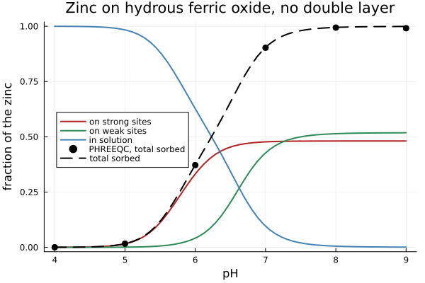

# [Two families of sites, and a metal between them](@id sec-example-hfo)

The canonical benchmark of surface complexation is **hydrous ferric oxide**, and
the reason it is canonical is a single modeling idea: a real oxide does not
offer one kind of site but two, and they differ in the two ways that matter
most.

Dzombak & Morel's ferrihydrite [DzombakMorel1990](@cite) has

  - **strong** sites, 0.005 mol per mole of iron, and
  - **weak** sites, 0.2 mol per mole of iron — forty times more of them —

which share their acid-base constants exactly, and differ by nearly **three
orders of magnitude** in how tightly they bind a metal. Neither number alone
does anything interesting. Together they produce the shape every sorption
experiment shows: at low loading a few strong sites take almost all the metal;
once they saturate the weak ones take over, and the curve bends.

This page builds that model, sorbs zinc onto it, and compares the result with
PHREEQC computing the same thing from its own database.

!!! note "What this is not, yet"
    This runs **without an electric double layer**, `-no_edl` on both sides. The
    published Dzombak & Morel calibration assumes a diffuse layer, so these
    constants are being used outside the model they were fitted in. That is
    legitimate as a cross-code check — the two codes are doing the same thing —
    and it is **not** a reproduction of the published titration. The layer is
    switched on at the end of this page, which is that reproduction; it is kept
    apart because comparing two codes on one model and comparing a model with
    and without its double layer are two different questions.

## The two families

Both hang from one support, and each carries its own pseudo-element, its own
budget and its own mixing.

```@example hfo
using ChemistryLab, DynamicQuantities, SciMLBase

const RT = R_GAS * 298.15
g0(v) = SymbolicFunc(v * u"J/mol")
mRT(logK) = -RT * log(10.0^logK)

# PHREEQC's own constants for this model.
logK_prot, logK_depr = 7.29, -8.93
logK_Zn_strong, logK_Zn_weak = 0.99, -1.99

# The aqueous species come from a database the package ships, not from numbers
# typed here — see [Where the numbers come from](@ref sec-manual-numbers).
db = Dict(symbol(s) => s for s in
          build_species(datapath("slop98-inorganic-thermofun.json"); verbose = false))
h2o, hp, oh = db["H2O@"], db["H+"], db["OH-"]
zn, na, cl = db["Zn+2"], db["Na+"], db["Cl-"]
G(s) = ustrip(us"J/mol", s[:ΔₐG⁰](T = 298.15u"K", P = 1.0e5u"Pa"; unit = true))

# Only the SURFACE species are built here, and only because no database carries
# them: their standard energies are constructed to *be* the log K above. The
# zinc complexes carry the aqueous zinc's own energy, because
# XsOH + Zn²⁺ = XsOZn⁺ + H⁺ puts it in the balance.
sf(sym, g) = (s = Species(sym; aggregate_state = AS_SURFACE, class = SC_SURFCOMPLEX);
              s[:ΔₐG⁰] = g0(g); s)

s_free, s_prot = sf("XsOH", 0.0), sf("XsOH2+", mRT(logK_prot))
s_depr, s_zn   = sf("XsO-", mRT(logK_depr)), sf("XsOZn+", mRT(logK_Zn_strong) + G(zn))
w_free, w_prot = sf("XwOH", 0.0), sf("XwOH2+", mRT(logK_prot))
w_depr, w_zn   = sf("XwO-", mRT(logK_depr)), sf("XwOZn+", mRT(logK_Zn_weak) + G(zn))

n_Fe = 1.0e-3
N_strong, N_weak, Zn_total = 0.005n_Fe, 0.2n_Fe, 1.0e-5

support = SurfaceSupport("hydrous ferric oxide", nothing, FixedSurfaceArea(53.4))
fam_s = SiteFamily("Hfo_s", s_free, [s_prot, s_depr, s_zn];
                   capacity = TotalSiteAmount(N_strong * u"mol"), support)
fam_w = SiteFamily("Hfo_w", w_free, [w_prot, w_depr, w_zn];
                   capacity = TotalSiteAmount(N_weak * u"mol"), support)
(fam_s, fam_w)
```

The two differ in their symbol, their budget and their zinc affinity. They
differ in nothing else — the protonation and deprotonation constants are the
same object twice.

## The system

```@example hfo
species = [h2o, hp, oh, zn, na, cl,
           s_free, s_prot, s_depr, s_zn, w_free, w_prot, w_depr, w_zn]
cs = ChemicalSystem(species, [h2o, hp, zn, na, cl, s_free, w_free];
                    site_families = [fam_s, fam_w])
cs.site_groups           # two groups, free site first in each
```

Each family gets its own conservation row, and each is closed on its own
members. Two families on one support share the mineral, not the budget.

```@example hfo
i = Dict(symbol(sp) => k for (k, sp) in enumerate(cs.species))
n0 = Any[fill(1.0e-14u"mol", length(cs.species))...]
n0[i["H2O@"]] = ustrip(us"mol", 1.0u"kg" / h2o[:M]) * u"mol"   # one kilogram
n0[i["Na+"]] = 0.01u"mol"; n0[i["Cl-"]] = 0.01u"mol"
n0[i["Zn+2"]] = Zn_total * u"mol"
n0[i["XsOH"]] = N_strong * u"mol"; n0[i["XwOH"]] = N_weak * u"mol"
state = ChemicalState(cs, n0)

des = DualEquilibriumSolver(cs, DaviesActivityModel())
b = Float64.(cs.SM.A) * Float64[ustrip(us"mol", x) for x in state.n]

function at(pH)
    eq = SciMLBase.solve(des, state; b = b, constraint = FixedpH(pH))
    n = Float64[ustrip(us"mol", x) for x in eq.n]
    return (strong = n[i["XsOZn+"]] / Zn_total,
            weak   = n[i["XwOZn+"]] / Zn_total,
            free   = n[i["Zn+2"]] / Zn_total)
end
at(7.0)
```

At pH 7, nine tenths of the zinc is on the surface — and **half of it sits on
sites that are forty times scarcer**. That is what a thousandfold affinity buys.

## The edge

```@example hfo
[(pH, round.(values(at(pH)); digits = 4)) for pH in 5.0:1.0:8.0]
```

Read the three columns across the rows. The strong sites fill first and stop:
they run out. The weak sites keep going, and by pH 8 they carry most of the
load simply because there are more of them.

```julia
using Plots

# PHREEQC's answer, from test/surface_complexation.jl
PHREEQC_PH     = [4.0, 5.0, 6.0, 7.0, 8.0, 9.0]
PHREEQC_SORBED = [0.00017033047684235052, 0.016218434554914892, 0.37188533609051405, 0.9028626468821174, 0.9939171294298249, 0.991222704808546]

pHs = range(4, 9; length = 60)
d = [at(pH) for pH in pHs]
p = plot(; xlabel = "pH", ylabel = "fraction of the zinc",
         title = "Zinc on hydrous ferric oxide, no double layer",
         legend = :left, ylims = (-0.02, 1.02))
plot!(p, pHs, [x.strong for x in d]; label = "on strong sites", color = :firebrick, lw = 2)
plot!(p, pHs, [x.weak for x in d];   label = "on weak sites",   color = :seagreen,  lw = 2)
plot!(p, pHs, [x.free for x in d];   label = "in solution",     color = :steelblue, lw = 2)
scatter!(p, PHREEQC_PH, PHREEQC_SORBED; label = "PHREEQC, total sorbed",
         color = :black, markersize = 5, markerstrokewidth = 0)
plot!(p, pHs, [x.strong + x.weak for x in d]; label = "total sorbed",
      color = :black, linestyle = :dash, lw = 2)
```



The strong-site curve is the one to watch. It rises first and steeply — a
thousandfold affinity wins the early competition outright, scarcity
notwithstanding — and then **stops flat at 0.48**. Nothing about the chemistry
changed there: it ran out of sites. There are 5 µmol of strong sites for 10 µmol
of zinc, so they cannot hold more than half of it however favorable the
reaction, and the plateau sits just under that ceiling because protons occupy
the rest.

Everything above that plateau is the weak sites, which take over precisely
because the strong ones are full. A single-site model produces neither the early
steepness nor the ceiling — it would give one sigmoid, and the experiment does
not.

## Against PHREEQC, and what the difference is

The black points are PHREEQC running the same model from its own database. They
sit on the dashed curve, and the worst departure across the edge is **0.94 %**.

That is a hundred times worse than the [protolysis
comparison](@ref sec-example-surface-langmuir), which agrees to 1.7 × 10⁻⁸, and
the reason is instructive: **the difference is not in the surface model**.

Zinc carries two charges, so its activity coefficient leaves 1 quickly — about
0.72 at an ionic strength of 0.01 by the Davies equation. A model that puts it
at 1 says the metal is more available than it is, and drives more sorption.
Running the identical system under both aqueous models turns that explanation
into a measurement:

| aqueous model | worst departure from PHREEQC |
|:--|--:|
| ideal (dilute) | 49 % |
| Davies | 0.94 % |

A factor of fifty, from changing nothing but what the aqueous phase does. The
0.94 % that remains is the distance between Davies and PHREEQC's own extended
Debye-Hückel — two aqueous models, neither of them this package's surface model.

That is also why the protolysis comparison was built without a metal: with only
protons involved, and the proton activity prescribed on both sides, no aqueous
activity coefficient enters at all, and the surface chemistry is compared alone.
`test/surface_complexation.jl` keeps both comparisons for that reason.

## The same edge, with the double layer

Everything above ran `-no_edl`. Dzombak & Morel's constants were fitted **with**
a diffuse layer, so this is the comparison that is actually a reproduction of
the published model rather than a cross-code check on a truncated one.

Two families sit on one oxide here, and that matters as soon as there is a
potential: a proton bound to a weak site charges the same surface a proton bound
to a strong site does, so both feel one `Ψ`. The potential belongs to the
support, not to the family.

```@example hfo
using JSON
DDL = JSON.parsefile(joinpath(pkgdir(ChemistryLab), "test", "reference",
                              "phreeqc_hfo_zn_ddl.json"))
layered = SiteFamily[]   # the same two families, with the layer on
for (name, free, others, N) in (
        ("Hfo_s", s_free, [s_prot, s_depr, s_zn], N_strong),
        ("Hfo_w", w_free, [w_prot, w_depr, w_zn], N_weak),
    )
    push!(layered, SiteFamily(name, free, others; capacity = TotalSiteAmount(N),
                              support, model = DiffuseLayer(; area = 53.4)))
end
cs_dl = ChemicalSystem(species, [h2o, hp, zn, na, cl, s_free, w_free];
                       site_families = layered)
j = Dict(symbol(sp) => k for (k, sp) in enumerate(cs_dl.species))
des_dl = DualEquilibriumSolver(cs_dl, DaviesActivityModel())

function sorbed_with_layer(pt)
    n0 = Any[fill(1.0e-14u"mol", length(cs_dl.species))...]
    n0[j["H2O@"]] = ustrip(us"mol", 1.0u"kg" / h2o[:M]) * u"mol"
    n0[j["Na+"]] = 0.01u"mol"
    # the chloride carries PHREEQC's own titrant, so the ionic strengths match
    n0[j["Cl-"]] = (2 * pt["I"] - 0.01 - 10.0^(-pt["pH"]) - 10.0^(pt["pH"] - 14))u"mol"
    n0[j["Zn+2"]] = Zn_total * u"mol"
    n0[j["XsOH"]] = N_strong * u"mol"; n0[j["XwOH"]] = N_weak * u"mol"
    st = ChemicalState(cs_dl, n0)
    bb = Float64.(cs_dl.SM.A) * Float64[ustrip(us"mol", x) for x in st.n]
    eq = SciMLBase.solve(des_dl, st; b = bb, constraint = FixedpH(pt["pH"]))
    n = Float64[ustrip(us"mol", x) for x in eq.n]
    return (n[j["XsOZn+"]] + n[j["XwOZn+"]]) / Zn_total
end

using Printf
println("  pH   no layer   with layer   PHREEQC (layer)")
for pt in DDL["points"]
    a = at(pt["pH"])
    @printf("%5.1f %10.4f %12.4f %16.4f\n",
            pt["pH"], a.strong + a.weak, sorbed_with_layer(pt),
            pt["zn_sorbed_fraction"])
end
```

The layer moves the edge by about **half a pH unit** — at pH 6 the sorbed
fraction falls from 0.37 to 0.18 — which is why a calibration made with it
cannot be used without it. The middle column follows the right-hand one to
0.5 %, slightly better than the 0.94 % of the comparison without the layer.

## See also

  - [A charged surface, screened](@ref sec-example-diffuse-layer) — the same
    layer on the acid-base half, across three ionic strengths, and why the
    potential is carried as an unknown.
  - [Adsorption on a single site family](@ref sec-example-surface-langmuir) —
    the same machinery on one family, against a closed form.
  - [Chemistry that happens on a surface](@ref sec-theory-surface) — where the
    electrostatic models are derived and what each costs the certificate.
