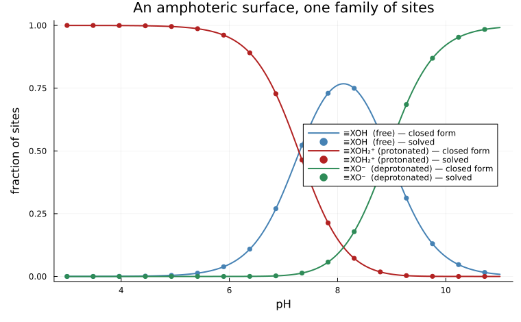

# [Adsorption on a single site family](@id sec-example-surface-langmuir)

!!! info "Before this page"
    [Chemistry that happens on a surface](@ref sec-theory-surface) §1 to §4, and
    [Surface areas](@ref sec-manual-surfaces) for the syntax.

The smallest complete surface calculation: **one family of sites on an oxide,
titrated by pH**. It is small enough to check by hand, and it exercises
everything the surface model does — a site budget, a conservation row, ideal
mixing on that budget, and competition between two occupied states for one
finite capacity.

The physics is the acid-base behavior of an oxide surface. A hydroxyl group
exposed on the grain takes a proton in acid and gives one up in base:

```math
\equiv\!\mathrm{XOH} + \mathrm{H^+} \rightleftharpoons \equiv\!\mathrm{XOH_2^+}
\qquad\text{and}\qquad
\equiv\!\mathrm{XOH} \rightleftharpoons \equiv\!\mathrm{XO^-} + \mathrm{H^+}
```

so the surface is positive in acid, negative in base, and neutral in between.
The constants below are Dzombak & Morel's for the weak sites of hydrous ferric
oxide [DzombakMorel1990](@cite), `log K = 7.29` and `log K = −8.93`, the values
PHREEQC ships.

## The species

A surface species is an ordinary species. What marks it is its aggregate state,
and the **site symbol in its formula** — `Xs` here — which is what turns the
site balance into a row of the conservation matrix.

```@example surface
using ChemistryLab, DynamicQuantities, SciMLBase

const RT = R_GAS * 298.15
g0(v) = SymbolicFunc(v * u"J/mol")          # a constant standard energy

# The constants are read from the copy of phreeqc.dat that the test oracles use,
# so this page and PHREEQC work from one set of numbers.
dat = read_sorption_model(joinpath(pkgdir(ChemistryLab), "test", "reference", "phreeqc.dat"))
log_k(product) = only(reactions_involving(dat, product)).log_K.value
logK₁, logK₂ = log_k("Hfo_wOH2+"), log_k("Hfo_wO-")   # protonation, deprotonation

free = Species("XsOH"; aggregate_state = AS_SURFACE, class = SC_SURFCOMPLEX)
free[:ΔₐG⁰] = g0(0.0)                       # the reference state of the family

prot = Species("XsOH2+"; aggregate_state = AS_SURFACE, class = SC_SURFCOMPLEX)
prot[:ΔₐG⁰] = g0(-RT * log(10.0^logK₁))     # ΔrG° = −RT ln K

depr = Species("XsO-"; aggregate_state = AS_SURFACE, class = SC_SURFCOMPLEX)
depr[:ΔₐG⁰] = g0(-RT * log(10.0^logK₂))

atoms(free)
```

`Xs` is the family; `O` and `H` are real atoms, and they are the only ones that
weigh anything — the support is weighed once, by its own mineral species.

```@example surface
free[:M]        # an oxygen and a hydrogen: the adsorbed part alone
```

## The surface, and its budget of sites

```@example surface
# The aqueous species come from a database the package ships, not from numbers
# typed here — see [Where the numbers come from](@ref sec-manual-numbers).
db = Dict(symbol(s) => s for s in
          build_species(datapath("slop98-inorganic-thermofun.json"); verbose = false))
h2o, hp, oh = db["H2O@"], db["H+"], db["OH-"]

N_sites = 2.0e-4                               # mol of sites
support = SurfaceSupport("hydrous ferric oxide", nothing, FixedSurfaceArea(600.0))
family  = SiteFamily("Hfo_w", free, [prot, depr];
                     capacity = TotalSiteAmount(N_sites * u"mol"), support)
```

`TotalSiteAmount` is the honest description of a batch experiment: a weighed
sorbent, a known number of sites. The two other forms — a density per square
meter, a capacity per kilogram — exist because published data comes in both, and
converting between them would need an area nobody measured.

## The system, and the row that makes it a surface

The **free site is the primary**. That is not a matter of taste: a bare site
species in its place is inconsistent in charge with a neutral free site, which
silently adds a spurious charge component to the matrix.

```@example surface
species = [h2o, hp, oh, free, prot, depr]
cs = ChemicalSystem(species, [h2o, hp, free]; site_families = [family])
row = cs.SM.A[findfirst(p -> symbol(p) == "XsOH", cs.SM.primaries), :]
Int.(row)
```

One per surface species, zero on every aqueous one. That row **is**

```math
n_{\equiv\mathrm{XOH}} + n_{\equiv\mathrm{XOH_2^+}} + n_{\equiv\mathrm{XO^-}} = N
```

and it was produced by the same matrix assembly that writes every other
conservation law. Nothing was special-cased for it.

## One point

Start with every site free, and hold the pH at 6.

```@example surface
n0 = Any[fill(1.0e-12u"mol", length(cs.species))...]
n0[1] = ustrip(us"mol", 1.0u"kg" / h2o[:M]) * u"mol"   # exactly one kilogram
n0[4] = N_sites * u"mol"
state = ChemicalState(cs, n0)

des = DualEquilibriumSolver(cs, DiluteSolutionModel())
b   = Float64.(cs.SM.A) * Float64[ustrip(us"mol", x) for x in state.n]

eq = SciMLBase.solve(des, state; b = b, constraint = FixedpH(6.0))
n  = Float64[ustrip(us"mol", x) for x in eq.n]
N  = n[4] + n[5] + n[6]
(free = n[4] / N, protonated = n[5] / N, deprotonated = n[6] / N)
```

At pH 6 the surface is mostly protonated, and almost none of it is
deprotonated — the second reaction's constant is nearly three orders of
magnitude below the proton activity that would drive it.

## Against the closed form

The point of the exercise. Eliminating the free site from the two mass-action
laws and the site balance gives the competitive Langmuir form, derived in
[the theory page](@ref sec-theory-surface):

```math
\frac{n_j}{N} = \frac{\beta_j}{1 + \beta_1 + \beta_2},
\qquad \beta_1 = K_1 a_{\mathrm{H^+}}, \quad \beta_2 = K_2 / a_{\mathrm{H^+}}
```

Both drives come from the same proton activity, which is why one constraint is
enough to test competition.

```@example surface
function solved(pH)
    eq = SciMLBase.solve(des, state; b = b, constraint = FixedpH(pH))
    n = Float64[ustrip(us"mol", x) for x in eq.n]
    N = n[4] + n[5] + n[6]
    return (n[4] / N, n[5] / N, n[6] / N)
end

function closed_form(pH)
    a_H = 10.0^(-pH)
    β = (10.0^logK₁ * a_H, 10.0^logK₂ / a_H)
    d = 1 + sum(β)
    return (1 / d, β[1] / d, β[2] / d)
end

worst = 0.0
for pH in 4.0:1.0:9.0
    s, c = solved(pH), closed_form(pH)
    global worst = max(worst, maximum(abs.(s ./ c .- 1)))
end
worst      # worst relative departure from the closed form, over six pH values
```

That is the solver and the algebra agreeing to the last digits either can claim.
No isotherm was written: Langmuir is what a conservation law and a mass-action
law produce together.

## Conservation, checked on its own scale

A residual is only meaningful against something. Water, a trace species and a
site budget differ by ten orders of magnitude, so each conserved quantity is
scaled by how much matter its own row moves.

```@example surface
A = Float64.(cs.SM.A)
eq_closed = SciMLBase.solve(des, state; b = b)          # no constraint: closed
nc = Float64[ustrip(us"mol", x) for x in eq_closed.n]
r  = A * nc .- b
turnover(c) = sum(abs(A[c, i]) * nc[i] for i in eachindex(nc))
[(symbol(p), abs(r[c]) / max(abs(b[c]), turnover(c))) for (c, p) in enumerate(cs.SM.primaries)]
```

The site row is conserved to the same precision as the water it sits in.

## The titration curve

```julia
using Plots

pHs = range(3, 11; length = 200)
curves = [solved(pH) for pH in pHs]
exact  = [closed_form(pH) for pH in pHs]

p = plot(;
    xlabel = "pH", ylabel = "fraction of sites",
    title  = "An amphoteric surface, one family of sites",
    legend = :right, ylims = (-0.02, 1.02),
)
for (k, (lab, col)) in enumerate((
        ("≡XOH  (free)", :steelblue),
        ("≡XOH₂⁺ (protonated)", :firebrick),
        ("≡XO⁻  (deprotonated)", :seagreen),
    ))
    plot!(p, pHs, [c[k] for c in exact];
          label = "$lab — closed form", color = col, linewidth = 2)
    scatter!(p, pHs[1:12:end], [c[k] for c in curves[1:12:end]];
             label = "$lab — solved", color = col, markersize = 4, markerstrokewidth = 0)
end
p
```



The two curves of each color are one curve.

Three features are worth reading off it, because each is the closed form made
visible:

  - the protonated fraction falls through one half near `pH = log K₁ = 7.29`,
    and the deprotonated one rises through one half near `pH = −log K₂ = 8.93`.
    **Near**, not at: with three states sharing one budget the half-point is
    pulled slightly by the third, to 0.494 rather than 0.500. A two-state model
    would put them exactly at the `pK`, and that small difference is the shared
    denominator doing its work;
  - the free fraction peaks at `pH = (log K₁ − log K₂)/2 = 8.11`, where the two
    drives are equal. Its height, `1/(1 + 2\sqrt{K_1 K_2}) = 0.768`, is not one:
    even at its most neutral the surface is a quarter occupied, because both
    reactions still run;
  - that same pH, where the positive and negative states are equally populated,
    is the **point of zero charge**.

## And against another code

The same calculation is checked against PHREEQC, running Dzombak & Morel's model
from its own database, in `test/surface_complexation.jl`. The comparison is made
at matched proton activity — which both codes prescribe exactly — so the aqueous
activity models, which differ, do not enter. With no metal in the system there
is nothing else they could enter through.

The worst relative departure over the six pH values is **1.7 × 10⁻⁸**.

## See also

  - [Chemistry that happens on a surface](@ref sec-theory-surface) — where the
    closed form above comes from, and what the model does not cover.
  - [Surface areas](@ref sec-manual-surfaces) — the syntax in full, including
    the three ways a site budget can be specified.
