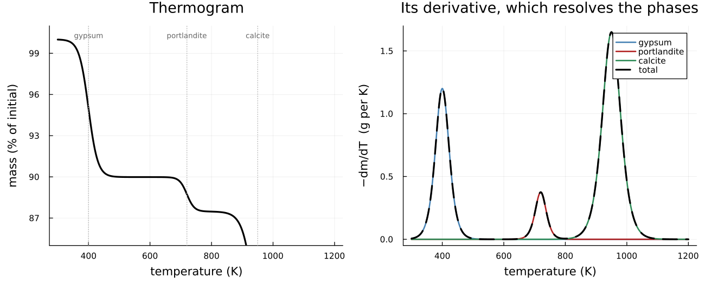

# [A thermogram, and the windows it takes to have one](@id sec-example-tga)

!!! info "Before this page"
    [Calibrating hydration kinetics on measured calorimetry](@ref
    ex-hydration-calibration), whose parameters this page constrains further.

Calorimetry constrains three combinations of six kinetic parameters and no more
— [the calibration example](@ref ex-hydration-calibration) measures exactly
that. Breaking the remaining correlations needs a measurement that sees the
**phases** rather than the heat, and thermogravimetry is the obvious one.

This page builds the forward operator, and then does the thing that makes it
useful: recovers its own parameters from a curve.

## What leaves, and how much

```@example tga
using ChemistryLab, DynamicQuantities, Printf

c18 = Dict(symbol(s) => s for s in
           build_species(datapath("cemdata18-thermofun.json"); verbose = false))
aq = Dict(symbol(s) => s for s in
          build_species(datapath("slop98-inorganic-thermofun.json"); verbose = false))

cs = ChemicalSystem(
    vcat([aq[k] for k in ("H2O@", "H+", "Ca+2", "SO4-2", "CO3-2")],
         [c18[k] for k in ("Portlandite", "Gp", "Cal")]),
    [aq[k] for k in ("H2O@", "H+", "Ca+2", "SO4-2", "CO3-2")],
)
i = Dict(symbol(sp) => k for (k, sp) in enumerate(cs.species))
n = Any[fill(1.0e-12u"mol", length(cs.species))...]
n[i["H2O@"]] = ustrip(us"mol", 1.0u"kg" / aq["H2O@"][:M]) * u"mol"
n[i["Portlandite"]] = 1.0u"mol"; n[i["Gp"]] = 2.0u"mol"; n[i["Cal"]] = 3.0u"mol"
state = ChemicalState(cs, n)

loss = ignition_loss(state)
# `uconvert` and not `ustrip(us"g", …)`: a symbolic unit does not convert
# implicitly, and kilograms asked for in grams is a DimensionError rather than
# a silent rescale — which is the behavior to want.
@printf("water  %7.3f g\nCO2    %7.3f g\ntotal  %7.3f g\n",
        ustrip(uconvert(us"g", loss.water)), ustrip(uconvert(us"g", loss.carbon_dioxide)),
        ustrip(uconvert(us"g", loss.total)))
```

[`ignition_loss`](@ref) counts **hydrogen**, not formula water. Portlandite is
`Ca(OH)₂`, has no `H₂O` written in it, and loses one per formula unit; a rule
that searched the formula for `H₂O` would report zero for it.

```@example tga
bound_water_per_phase(state)
```

That is the total, per phase. It is not a thermogram.

## Windows, and saying where they came from

A thermogram needs to know *when* each phase goes. That is not a consequence of
a formula, so it comes from a publication or from a measurement — and
[`DecompositionWindow`](@ref) makes a curve say which.

The ones below are **neither**. They are placeholders, chosen to exercise the
forward path, and they print as placeholders for exactly as long as they are
placeholders.

```@example tga
placeholder(phase, T½, w; releases = :water) = DecompositionWindow(
    phase, T½, w; releases,
    kind = PROV_PLACEHOLDER, source = "illustrative, not measured",
)
windows = [
    placeholder("Gp", 400.0, 15.0),
    placeholder("Portlandite", 720.0, 12.0),
    placeholder("Cal", 950.0, 20.0; releases = :carbon_dioxide),
]
provenance_report([w.midpoint for w in windows])
```

`weakest = PROV_PLACEHOLDER` is the report doing its job: whatever comes out of
a calculation resting on these is a picture, not a measurement.

```@example tga
grid = range(300.0, 1200.0; length = 451)
tg = thermogram(state, windows; temperatures = grid)
@printf("starts at %7.3f g, ends at %7.3f g, loses %7.3f g (ignition_loss says %7.3f)\n",
        ustrip(uconvert(us"g", tg.mass[1] * us"kg")), ustrip(uconvert(us"g", tg.mass[end] * us"kg")),
        ustrip(uconvert(us"g", tg.loss[end] * us"kg")), ustrip(uconvert(us"g", loss.total)))
```

The curve integrates to what the formulas say, which is the first thing to check
and the one a wrong window silently breaks.

!!! warning "A phase with no window never leaves"
    It contributes to the starting mass and stays there, so a curve computed
    without noticing integrates to less than `ignition_loss` — and says nothing
    about it. [`phases_without_windows`](@ref) is how to see it — reporting
    `phase => product`, because a carbonated hydrate needs two windows and
    counting per phase would call it covered when half of it is.

    ```@example tga
    phases_without_windows(state, windows[1:2])   # calcite left out
    ```



## Recovering the windows from the curve

Here is why the operator is written as a smooth function of its windows. Given a
thermogram, the windows are **identifiable**, and the machinery that says whether
a parameter is determined is the machinery that determines it.

```@example tga
target = tg.dtg       # a measured curve, in a real case

forward(θ) = thermogram(
    state, with_window_parameters(windows, θ; kind = PROV_UNSTATED);
    temperatures = grid,
).dtg

# Gauss-Newton in log space, on the same sensitivity matrix `identifiability`
# uses — the machinery that says whether a parameter is determined is the
# machinery that determines it.
function identify(θ0; iterations = 40)
    θ = copy(θ0)
    for _ in 1:iterations
        J = log_sensitivity(forward, θ; relstep = 1.0e-3)
        θ = θ .* exp.(clamp.(-(J \ (forward(θ) .- target)), -0.3, 0.3))
    end
    return θ
end

θ0 = window_parameters(windows)[1] .* [1.1, 1.4, 0.945, 0.6, 1.042, 1.4]
θ = identify(θ0)
truth = window_parameters(windows)[1]
@printf("started %4.0f K and %2.0f%% away; recovered to %.2e relative\n",
        maximum(abs.(θ0 .- truth)), 40, maximum(abs.(θ .- truth) ./ truth))
```

And then the question that matters more than the numbers:

```@example tga
id = identifiability(forward, θ; observed = target,
                     names = window_parameters(windows)[2])
id
```

Six parameters, six directions constrained — because the three peaks are well
separated, and the spectrum falls off by factors of two and three with no drop
anywhere. That is not the usual case.

## Where it stops, and why that is the useful part

```@example tga
overlapped = [placeholder("Gp", 400.0, 15.0), placeholder("Portlandite", 405.0, 15.0)]
fwd2(θ) = thermogram(state, with_window_parameters(overlapped, θ; kind = PROV_UNSTATED);
                     temperatures = grid).dtg
θ2, names2 = window_parameters(overlapped)
identifiability(fwd2, θ2; names = names2)
```

Two phases releasing 5 K apart, and the rank comes out **two of four** — which
is exactly what the curve looks like: **one** peak, with a position and a width,
rather than two with four parameters between them. The spectrum says the same
thing more bluntly, `[0.055, 0.0054, 0.00048, 0.00016]`: two drops of about ten
and then nothing. A fit would still return four numbers.

This is the ordinary case in a cement paste — C-S-H, AFt and AFm all release
below 200 °C — which is why running [`identifiability`](@ref) on the windows is
not a formality.

```@example tga
null_participation(identifiability(fwd2, θ2; names = names2))
```

That is what `as_traced` reads to decide which parameters to report as fitted
and which as `PROV_PLACEHOLDER` — a number the curve did not determine is one
the optimizer had to leave somewhere. It reads the **subspace**, not the
parameter's position relative to the rank: the rank counts directions, the
position is the packing order, and confusing them flags whichever of a
trading-off pair happened to be listed second.

## What this settles

  - The **total** comes from the formulas, exactly, and counts hydrogen rather
    than formula water.
  - The **shape** comes from windows, which are published, measured, or declared
    placeholders — and which of the three is carried by the value, not by a
    comment.
  - The windows are **recoverable from a curve**, so a phase nobody has titrated
    is a parameter to identify rather than a reason to stop.
  - And what a curve cannot determine is **reported as not determined**, which
    is the difference between a fit and a measurement.

## See also

  - [The water budget of a hydrating paste](@ref sec-theory-water-budget) — what
    bound water is, and why the pore solution is not it.
  - [Where the numbers come from](@ref sec-manual-numbers) — provenance, and
    what to do when the number does not exist yet.
  - [Calibrating hydration kinetics](@ref ex-hydration-calibration) — the
    measurement this one is meant to join.
