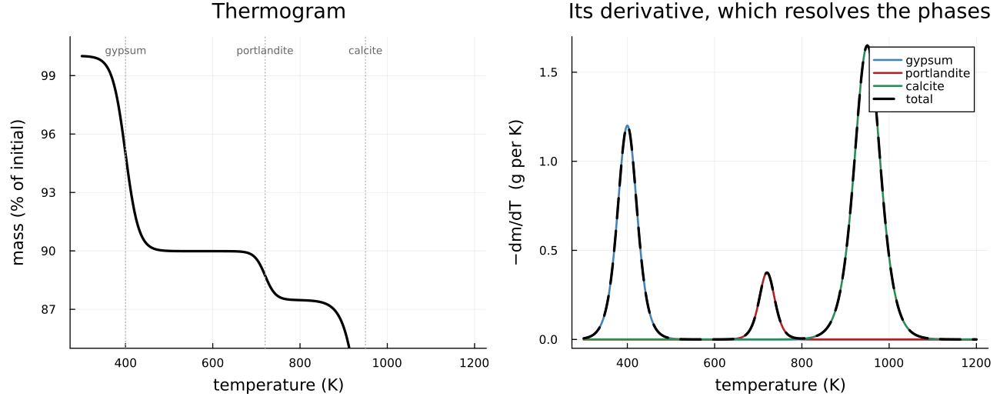

# [Bound water of CEM I 52.5 N and slag pastes, and the thermogram it integrates to](@id sec-example-tga)

!!! info "Before this page"
    [CEM I 52.5 N and slag in an isothermal calorimeter, read off the states](@ref sec-example-isothermal),
    which builds the same pastes.

A thermobalance weighs a dried sample while heating it. Between the drying
temperature and the end of the run, the loss is the water the hydrates held and
the carbon dioxide the carbonates held; the first, per gram of binder, is the
*bound water* $w_b$. It is read off a state as the heat is: from the amounts of
the solids and their formulas, with no reaction to write. The pastes are those of
[Gruyaert2010](@cite), whose bound water was measured by thermogravimetry from
378 K (105 °C) to 1123 K (850 °C) under nitrogen, the loss of the decarbonation
around 923 K subtracted, once a week in methanol and a week over silica gel had
arrested the hydration.

## What leaves, and how much

The plain paste at 28 months, the cement at the 74 % the image analysis gives,
built by `scripts/gruyaert2010.jl` as on the calorimetry page.

```@example tga
using ChemistryLab, DynamicQuantities, Printf
include(joinpath(pkgdir(ChemistryLab), "scripts", "gruyaert2010.jl"))

cs = gruyaert_system()
G10(table, column; where...) = only(getproperty(literature_table("Gruyaert2010", table; where...), column))
αc(days, sb) = G10("hydration_degree", :alpha_cement; age_days = days * u"d", slag_to_binder = sb) / 100
αs(days, sb) = sb == 0 ? 0.0 :
    G10("hydration_degree_slag", :alpha_slag; age_days = days * u"d", slag_to_binder = sb) / 100
paste(days, sb) = gruyaert_paste(cs; slag = sb, alpha_cement = αc(days, sb), alpha_slag = αs(days, sb))

opc = paste(852, 0.0)
g(q) = ustrip(uconvert(us"g", q))
loss = ignition_loss(opc.eq)
@printf("certified %s; water %.2f g, CO2 %.2f g per 100 g of binder\n",
        opc.certificate.optimal, g(loss.water), g(loss.carbon_dioxide))
```

[`ignition_loss`](@ref) counts **hydrogen**, not formula water. Portlandite is
`Ca(OH)₂`, has no `H₂O` written in it, and loses one per formula unit; a rule
that searched the formula for `H₂O` would report none for it. Per phase:

```@example tga
for (ph, m) in bound_water_per_phase(opc.eq)                 # largest first
    g(m) > 0.05 && @printf("  %-15s %5.2f g\n", ph, g(m))
end
```

## Against the thermobalance

The four pastes at the degrees of hydration of the image analysis, and the
bound water of Fig. 7 at the nearest age, from the batch whose composition is
that of the calorimetry (TG/b of Table 1). The image analysis is at 28 months and
the thermogravimetry at 1018 days for the pastes with 0 and 50 % slag, at 363
days for the one with 85 %; the extrapolation to infinite time the article fits
on each series, $w_{b,\infty}$, is the other comparison.

```@example tga
wb_measured(sb, days) = only(literature_table("Gruyaert2010", "bound_water";
    batch = "b", slag_to_binder = sb, age_days = days * u"d").bound_water)
wb_inf(sb) = G10("bound_water_infinity", :bound_water_infinity; slag_to_binder = sb)
rows = [(2, 0.0, 1.997), (852, 0.0, 1018.264), (852, 0.5, 1018.264), (852, 0.85, 363.392)]
println("  age  s/b    αc    αs   computed (ettringite)  measured (age)   w_b,∞")
for (days, sb, tg) in rows
    p = paste(days, sb)
    p.certificate.optimal || error("uncertified paste")
    aft = g(get(Dict(bound_water_per_phase(p.eq)), "ettringite", 0.0u"kg"))
    @printf("%5d  %4.2f  %4.2f  %4.2f   %6.2f  (%5.2f)      %6.2f (%4.0f d)   %s\n", days, sb,
            αc(days, sb), αs(days, sb), g(bound_water(p.eq)), aft, wb_measured(sb, tg), tg,
            days == 2 ? "  —" : @sprintf("%5.1f", wb_inf(sb)))
end
```

The calculation counts every hydrogen of the solids, the thermobalance only what
leaves above 105 °C once the sample has been dried, so that the computed water is
the larger in the four pastes, by 6.6 to 11.4 g per 100 g of binder, and the gap
is not a constant fraction of it: the ratio is 2.0 at 2 days, 1.3 for the plain
paste at 28 months and 1.6 for the two blends. In the plain paste the ettringite,
which holds all the sulfate at both ages, carries 7.4 g of the computed water;
in the blends it carries about 2 g, and the gap lies in the other hydrates. The
drop at 85 % slag is found, from 31.6 to 18.7 g where the measurement goes from
20.2 to 11.5 g, whereas the order of the plain paste and of the blend with half
slag is not: the blend holds more water than the plain paste in the calculation
and less in the measurement. Which part of the water of each hydrate leaves
before 105 °C is what a decomposition window per phase would state, and none is
published for these pastes; the section below shows how such windows are
identified from a measured curve, and what a curve cannot separate.

## The shape of the curve, as a method

A total is not a thermogram. The curve needs to know *when* each phase goes,
which is not a consequence of a formula; it comes from a publication or from a
measurement, and [`DecompositionWindow`](@ref) makes a curve say which. This
section is a self-test of that machinery on a mixture of portlandite, gypsum and
calcite, with windows that are **neither published nor measured**: the target
curve below is the model's own output, and nothing in it is a measurement.

```@example tgawin
using ChemistryLab, DynamicQuantities, Printf

c18 = Dict(symbol(s) => s for s in
           build_species(datapath("cemdata18-thermofun.json"); verbose = false))
aq = Dict(symbol(s) => s for s in
          build_species(datapath("slop98-inorganic-thermofun.json"); verbose = false))

cs = ChemicalSystem(
    vcat([aq[k] for k in ("H2O@", "H+", "Ca+2", "SO4-2", "CO3-2")],
         [c18[k] for k in ("Portlandite", "Gp", "Cal")]),
    [aq[k] for k in ("H2O@", "H+", "Ca+2", "SO4-2", "CO3-2")],
)
i = Dict(symbol(sp) => k for (k, sp) in enumerate(cs.species))
n = Any[fill(1.0e-12u"mol", length(cs.species))...]
n[i["H2O@"]] = ustrip(us"mol", 1.0u"kg" / aq["H2O@"][:M]) * u"mol"
n[i["Portlandite"]] = 1.0u"mol"; n[i["Gp"]] = 2.0u"mol"; n[i["Cal"]] = 3.0u"mol"
state = ChemicalState(cs, n)
loss = ignition_loss(state);
```

```@example tgawin
placeholder(phase, T½, w; releases = :water) = DecompositionWindow(
    phase, T½, w; releases,
    kind = PROV_PLACEHOLDER, source = "illustrative, not measured",
)
windows = [
    placeholder("Gp", 400.0, 15.0),
    placeholder("Portlandite", 720.0, 12.0),
    placeholder("Cal", 950.0, 20.0; releases = :carbon_dioxide),
]
provenance_report([w.midpoint for w in windows])
```

`weakest = PROV_PLACEHOLDER` is the report doing its job: whatever comes out of
a calculation resting on these is a picture, not a measurement.

```@example tgawin
grid = range(300.0, 1200.0; length = 451)
tg = thermogram(state, windows; temperatures = grid)
@printf("starts at %7.3f g, ends at %7.3f g, loses %7.3f g (ignition_loss says %7.3f)\n",
        ustrip(uconvert(us"g", tg.mass[1] * us"kg")), ustrip(uconvert(us"g", tg.mass[end] * us"kg")),
        ustrip(uconvert(us"g", tg.loss[end] * us"kg")), ustrip(uconvert(us"g", loss.total)))
```

The curve integrates to what the formulas say, which is the first thing to check
and the one a wrong window silently breaks.

!!! warning "A phase with no window never leaves"
    It contributes to the starting mass and stays there, so a curve computed
    without noticing integrates to less than `ignition_loss` — and says nothing
    about it. [`phases_without_windows`](@ref) is how to see it — reporting
    `phase => product`, because a carbonated hydrate needs two windows and
    counting per phase would call it covered when half of it is.

    ```@example tgawin
    phases_without_windows(state, windows[1:2])   # calcite left out
    ```



### Recovering the windows from the curve

Here is why the operator is written as a smooth function of its windows. Given a
thermogram, the windows are **identifiable**, and the machinery that says whether
a parameter is determined is the machinery that determines it.

```@example tgawin
target = tg.dtg       # the model's own curve: a self-test, not a measurement

forward(θ) = thermogram(
    state, with_window_parameters(windows, θ; kind = PROV_UNSTATED);
    temperatures = grid,
).dtg

# Gauss-Newton in log space, on the same sensitivity matrix `identifiability`
# uses — the machinery that says whether a parameter is determined is the
# machinery that determines it.
function identify(θ0; iterations = 40)
    θ = copy(θ0)
    for _ in 1:iterations
        J = log_sensitivity(forward, θ)
        θ = θ .* exp.(clamp.(-(J \ (forward(θ) .- target)), -0.3, 0.3))
    end
    return θ
end

θ0 = window_parameters(windows)[1] .* [1.1, 1.4, 0.945, 0.6, 1.042, 1.4]
θ = identify(θ0)
truth = window_parameters(windows)[1]
@printf("started %4.0f K and %2.0f%% away; recovered to %.2e relative\n",
        maximum(abs.(θ0 .- truth)), 40, maximum(abs.(θ .- truth) ./ truth))
```

And then the question that matters more than the numbers:

```@example tgawin
id = identifiability(forward, θ; observed = target,
                     names = window_parameters(windows)[2])
id
```

Six parameters, six directions constrained — because the three peaks are well
separated and the curve is fitted exactly, so that the noise level takes its
floor, `√eps` times the root-mean-square of the curve, and the standard error of
every direction is far below one. That is not the usual case. The spectrum does
fall by a factor of 5.8 between its third and fourth values: a log-sensitivity
carries the size of its parameter, some hundreds of kelvin for a midpoint and
some tens for a width. Read off that gap alone, without a noise level, the rank
would have been three.

### Where it stops, and why that is the useful part

```@example tgawin
overlapped = [placeholder("Gp", 400.0, 15.0), placeholder("Portlandite", 405.0, 15.0)]
fwd2(θ) = thermogram(state, with_window_parameters(overlapped, θ; kind = PROV_UNSTATED);
                     temperatures = grid).dtg
θ2, names2 = window_parameters(overlapped)
identifiability(fwd2, θ2; names = names2)
```

Two phases releasing 5 K apart, and the rank comes out at **one of four**: the
position of what the curve shows as one peak, the spectrum falling by 10.6 after
its first value and by 8.7 after its second. The two midpoints are correlated at
−0.995, so that position is a combination of both, and two peaks with four
parameters between them are not there to be seen. A fit would still return four
numbers.

This is the ordinary case in a cement paste — C-S-H, AFt and AFm all release
below 200 °C — which is why running [`identifiability`](@ref) on the windows is
not a formality.

```@example tgawin
null_participation(identifiability(fwd2, θ2; names = names2))
```

That is what `as_traced` reads to decide which parameters to report as fitted
and which as `PROV_PLACEHOLDER` — a number the curve did not determine is one
the optimizer had to leave somewhere. It reads the **subspace**, not the
parameter's position relative to the rank: the rank counts directions, the
position is the packing order, and confusing them flags whichever of a
trading-off pair happened to be listed second.

## What a thermogram is plotted against, and windows given as intervals

A thermobalance records the mass of the sample as it is heated
[Lever2014](@cite). What the cement literature reports is the mass **lost**, in
percent of a reference mass, and the papers co-authored by Lothenbach, whose
method is set out in [LothenbachDurdzinskiDeWeerdt2016](@citet), do not all take
the same reference. Three are in use, and the data files of this package carry
each with its source:

| reference mass | used by | `relative_to` |
|:--|:--|:--|
| the sample at the start of the run | the thermograms of [Deschner2012](@citet) | `:initial` (default) |
| the dry sample at a temperature | 500 °C, [Scholer2015](@cite); 800 °C, [Shi2016](@cite) | that temperature |
| the sample ignited at 980 °C | [ShiLothenbach2020](@citet) | `980 + 273.15`, or `:ignited` |

`thermogram` returns the mass and the loss in kilograms, and both again in
percent of the reference `relative_to` names (`mass_percent`, `loss_percent`,
the loss counted from the first temperature of the grid). The reference mass is
computed at its own temperature, not read off the nearest point of the grid.

```@example tgawin
dry = literature_value("Scholer2015", "tga_dry_solids_temperature")   # 500 °C
for (label, ref) in ((":initial", :initial), ("dry at 500 °C", dry), (":ignited", :ignited))
    t = thermogram(state, windows; temperatures = grid, relative_to = ref)
    @printf("%-14s reference %7.3f g   loss at the end %6.2f %%\n",
            label, ustrip(uconvert(us"g", t.reference_mass * us"kg")), t.loss_percent[end])
end
```

The same loss is a larger percentage of a smaller reference: which convention a
measured curve follows has to be read in its paper before it is compared with
one computed here.

**The papers also attribute a loss to a phase by a temperature interval**:
portlandite between 350 and 500 °C [DeWeerdt2011](@cite), the carbonate from
about 300 to 850 °C [Shi2016](@cite), the water of ettringite between 30 and
150 °C [Moschner2009](@cite), the total bound water between 30 and 550 °C
[LHopital2016](@cite). A window can be given that way, `between = (T₁, T₂)`:
the phase then releases everything inside the interval and nothing outside it,
along a smooth step whose rate vanishes at both ends.

```@example tgawin
ch = literature_table("DeWeerdt2011", "tga_intervals")
cc = literature_table("Shi2016", "tga_intervals")
from_papers = [
    windows[1],      # gypsum: no interval in these papers, the placeholder kept
    DecompositionWindow("Portlandite"; between = (only(ch.lower), only(ch.upper)),
                        kind = PROV_PUBLISHED, source = "DeWeerdt2011"),
    DecompositionWindow("Cal"; between = (only(cc.lower), only(cc.upper)),
                        releases = :carbon_dioxide, kind = PROV_PUBLISHED, source = "Shi2016"),
]
T1, T2 = window_interval(from_papers[2])
t = thermogram(state, from_papers; temperatures = [T1, T2], relative_to = dry)
inside(phase) = t.by_phase[phase][2] - t.by_phase[phase][1]
@printf("lost between %.0f and %.0f °C: %.3f g of portlandite water, %.3f g of calcite CO2\n",
        T1 - 273.15, T2 - 273.15, 1000 * inside("Portlandite"), 1000 * inside("Cal"))
@printf("portlandite holds %.3f g of water\n",
        ustrip(uconvert(us"g", Dict(bound_water_per_phase(state))["Portlandite"])))
```

The interval gives the portlandite all its water and nothing else. The loss read
over that interval holds more: the carbonate's interval overlaps it, and part of
the calcite's carbon dioxide leaves between 350 and 500 °C as well, which is the
loss a reading has to separate ([LHopital2016](@citet) quantify portlandite from
the loss around 450 °C by the tangent method). A logistic window spread over the same interval, 1 % released at one end and 99 %
at the other ([`window_interval`](@ref)), would put 2 % of the portlandite's
water outside it. Both forms can be mixed in one set, fitted to a curve
([`window_parameters`](@ref) gives an interval's two ends), and read by
[`bound_water`](@ref) over a temperature range, as a recipe's bound water is
compared with a measurement.

## See also

  - [CEM I 52.5 N and slag in an isothermal calorimeter, read off the states](@ref sec-example-isothermal),
    the heat of the same pastes.
  - [The water budget of a hydrating paste](@ref sec-theory-water-budget), what
    bound water is and why the pore solution is not it.
  - [Where the numbers come from](@ref sec-manual-numbers), provenance and what
    to do when the number does not exist yet.
  - [Calibrating hydration kinetics](@ref ex-hydration-calibration), where the
    correlations calorimetry leaves call for a second measurement.
