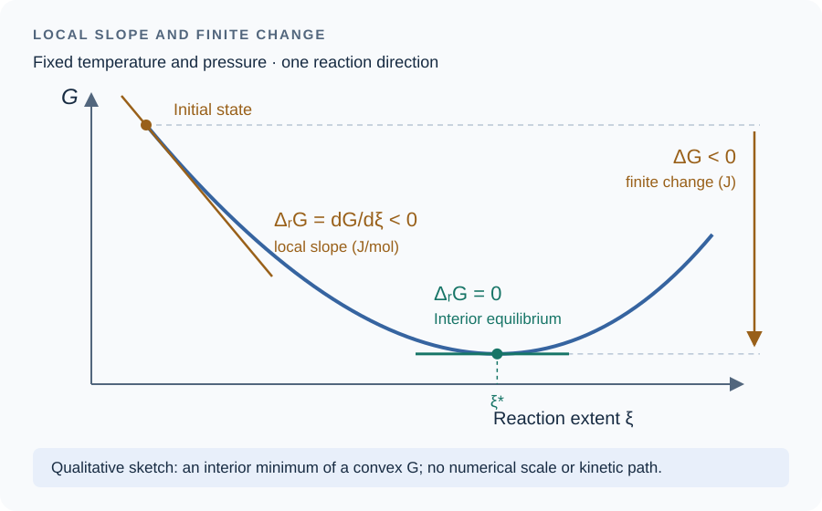
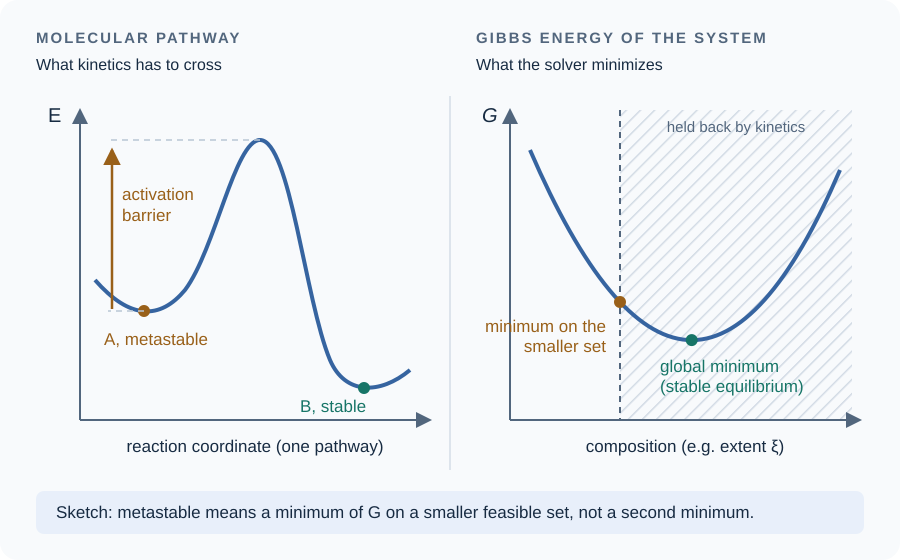

# [The chemical potential and reactions](@id sec-theory-basics)

[The two laws, and what the Gibbs energy measures](@ref sec-theory-laws) ends
with the Gibbs energy of a system whose composition is fixed. This page lets the
composition change, by exchange of matter or by reaction, which brings in the
chemical potential, and follows it to the equilibrium constant of a reaction.
[Formation quantities and the database](@ref sec-theory-formation) then shows
what a database stores to evaluate these potentials.

!!! tip "Questions this page answers"
      - What is a chemical potential, and why is the Gibbs energy the sum of the
        potentials?
      - Why can a model not choose the activity of water independently of the
        solutes?
      - What is the difference between ``\Delta_r G`` and ``\Delta G``, and
        what vanishes at equilibrium?
      - If a reaction lowers ``G``, why does it sometimes not happen?

## 1. Open systems: the chemical potential


When matter is exchanged or transformed, ``G`` depends on the amounts as well, and
its differential gains one term per constituent,

```math
\mathrm{d}G = -S\,\mathrm{d}T + V\,\mathrm{d}P + \sum_i \mu_i\,\mathrm{d}n_i ,
\qquad
\mu_i = \left(\frac{\partial G}{\partial n_i}\right)_{T,P,n_{j\neq i}} .
```

The chemical potential ``\mu_i`` is thus the partial molar Gibbs energy of
constituent ``i``: the change of ``G`` per mole of ``i`` added to a system so
large that its composition does not change [AndersonCrerar1993](@cite) (§9.2).
Every extensive quantity has partial molar counterparts defined in the same
way, among which the partial molar enthalpy ``h_i = (\partial H/\partial
n_i)_{T,P,n_{j\neq i}}`` and entropy ``s_i``. Differentiating ``G = H - TS``
with respect to ``n_i`` gives ``\mu_i = h_i - T s_i``, and differentiating the
Gibbs-Helmholtz relation of
[The two laws, and what the Gibbs energy measures](@ref sec-theory-laws) §5
in the same way gives

```math
\left(\frac{\partial (\mu_i/T)}{\partial T}\right)_{P,n} = -\frac{h_i}{T^2} .
```

This is the link between the two families of quantities: the chemical potential
carries the Gibbs energy of a constituent, its temperature dependence carries
the enthalpy.

### [Euler's theorem: the Gibbs energy is the sum of the potentials](@id sec-theory-euler)

The Gibbs energy is extensive. Take a phase at fixed temperature and pressure,
and a second phase identical to it in every respect but ``\lambda`` times larger,
every amount multiplied by ``\lambda``: it has ``\lambda`` times the Gibbs energy,

```math
G(T, P, \lambda n_1, \dots, \lambda n_N) = \lambda\, G(T, P, n_1, \dots, n_N)
\qquad \text{for every } \lambda > 0 .
```

A function with this property is said to be homogeneous of degree one in the
amounts. Differentiating both sides with respect to ``\lambda``, the left-hand
side through each of its arguments ``\lambda n_i`` by the chain rule, gives

```math
\sum_i n_i\,\frac{\partial G}{\partial n_i}(T, P, \lambda n_1, \dots, \lambda n_N)
  = G(T, P, n_1, \dots, n_N) ,
```

and at ``\lambda = 1`` the derivatives are the chemical potentials. This is
Euler's theorem on homogeneous functions, and it gives the Gibbs energy of the
phase as the sum of the amounts weighted by their potentials
[AndersonCrerar1993](@cite) (§9.2),

```math
G = \sum_i n_i\,\mu_i ,
\qquad
H = \sum_i n_i\,h_i ,
```

the second following in the same way, since ``H`` is extensive too.

The result is less obvious than it looks, because ``\mu_i`` depends on the
composition: adding a constituent changes the potentials of all the others.
A construction shows why the sum is nevertheless exact. Build the phase from
nothing by adding all its constituents at once, in their final proportions,
``\mathrm{d}n_i = n_i\,\mathrm{d}\lambda`` with ``\lambda`` running from 0 to 1.
The composition is the same at every stage, so every potential keeps its final
value throughout, and the Gibbs energy accumulates as
``\sum_i \mu_i\,\mathrm{d}n_i = \left(\sum_i \mu_i n_i\right)\mathrm{d}\lambda``,
whose integral from 0 to 1 is ``\sum_i n_i\,\mu_i``. Since ``G`` is a state
function, any other way of building the same phase leads to the same value.

Two consequences are used throughout the chapter. The enthalpy of a system, and
hence the heat of a change at constant pressure, is obtained by weighting the
partial molar enthalpies by the amounts. And the function a Gibbs minimization
works on, ``\sum_i n_i\,\mu_i(\mathbf{n})`` in
[Thermochemistry](@ref sec-theory-thermo) §4, is the Gibbs energy itself, not
an approximation of it. A system of several phases is the sum of its phases,
each obeying the theorem for its own amounts.

### [Gibbs-Duhem: the potentials of one phase are not independent](@id sec-theory-gibbs-duhem)

Differentiating Euler's expression gives
``\mathrm{d}G = \sum_i \mu_i\,\mathrm{d}n_i + \sum_i n_i\,\mathrm{d}\mu_i``. At
fixed ``T`` and ``P``, the differential of ``G`` written at the start of this
section is ``\mathrm{d}G = \sum_i \mu_i\,\mathrm{d}n_i`` alone, so the second sum
must vanish. This is the Gibbs-Duhem relation, which holds within each phase,

```math
\sum_i n_i\,\mathrm{d}\mu_i = 0 \qquad (T,\ P \text{ fixed}) .
```

Its content is a count. The potentials of a phase depend on its composition
only, not on its size, and ``N`` constituents have ``N - 1`` independent
proportions. The ``N`` potentials therefore cannot vary independently: once
``N - 1`` of them are given, the relation fixes the change of the last. At
variable temperature and pressure it reads
``S\,\mathrm{d}T - V\,\mathrm{d}P + \sum_i n_i\,\mathrm{d}\mu_i = 0``.

Take water and one solute. The amount of solute is measured by its molality
``m = n_s/(n_w M_w)``, in moles per kilogram of *water*, ``M_w`` being the molar
mass of water in kg/mol; it is the concentration scale of aqueous chemistry
because a mass of water does not change with temperature or pressure, whereas a
volume of solution, on which a molarity in mol/L is built, does. For this
mixture the relation gives ``n_w\,\mathrm{d}\mu_w = -n_s\,\mathrm{d}\mu_s``,
and with ``n_s/n_w = M_w m``,

```math
\mathrm{d}\mu_w = -M_w\, m\;\mathrm{d}\mu_s .
```

Adding solute raises its potential and lowers that of the water, in a ratio set
by the composition. If the solute is ideal, its potential is
``\mu_s = \mu_s^\circ + RT\ln m``, a form written in general just below,
and ``\mathrm{d}\mu_s = RT\,\mathrm{d}m/m``, so that
``\mathrm{d}\ln a_w = -M_w\,\mathrm{d}m``, and integrating from pure water gives
``\ln a_w = -M_w\, m``. The water activity is then not a separate choice: it is
fixed by the solute's activity.

This is the general point. A model cannot prescribe the activity of the solvent
independently of the activity coefficients it assigns to the solutes; it is by
this relation that
[Activity models](@ref sec-theory-activity) §3 obtains the activity of water,
and a model that does otherwise no longer derives from one Gibbs energy
([Does a model come from one excess Gibbs energy at all?](@ref sec-theory-potential)).

### [Activity, and the enthalpy of a mixture](@id sec-theory-mixture-enthalpy)

The chemical potential of a constituent of a mixture is written as a standard
part, the potential ``\mu_i^\circ(T,P)`` of a reference state, plus a
contribution of the composition through the activity ``a_i``,

```math
\mu_i = \mu_i^\circ(T,P) + RT\ln a_i ,
```

the reference state being the subject of [Standard states](@ref sec-theory-standard-states).
Inserted in the temperature derivative of ``\mu_i/T`` given at the start of
this section, the logarithm of an ideal activity does not
depend on temperature at fixed composition and drops out, so that the partial
molar enthalpy of a constituent of an ideal mixture is its standard enthalpy
``h_i^\circ``; a non-ideal mixture adds an excess enthalpy, carried by the
temperature dependence of the activity coefficients. The enthalpy of a state
evaluated by [`enthalpy`](@ref), and with it the heat of the calorimeters, is
``\sum_i n_i h_i^\circ``, which leaves the excess enthalpies out.

### [The Gibbs energy of a reaction is a slope, not a difference](@id sec-theory-reaction-gibbs)

Let one reaction ``\sum_i \nu_i\,\mathrm{A}_i = 0`` proceed in a closed system,
the coefficients ``\nu_i`` being counted positive for the products. Its progress
is measured by the extent of reaction ``\xi``, in moles, defined by
``\mathrm{d}n_i = \nu_i\,\mathrm{d}\xi`` for every constituent, so that one mole
of extent consumes ``|\nu_i|`` moles of each reactant and produces ``\nu_i``
moles of each product. At fixed temperature and pressure the differential of
``G`` written above becomes ``\mathrm{d}G = \sum_i \nu_i\,\mu_i\,\mathrm{d}\xi``,
and the Gibbs energy of reaction is the derivative

```math
\Delta_r G \;\equiv\; \left(\frac{\partial G}{\partial \xi}\right)_{T,P}
  = \sum_i \nu_i\,\mu_i .
```

Despite its ``\Delta``, ``\Delta_r G`` is not a difference between two states.
It is the slope of ``G`` along the reaction at the current composition, in
J/mol, and it changes as the reaction proceeds, since the potentials depend on
the amounts. The change of the Gibbs energy between two states joined by that
reaction is the integral of the slope,

```math
\Delta G = G(\xi_2) - G(\xi_1) = \int_{\xi_1}^{\xi_2} \Delta_r G\;\mathrm{d}\xi ,
```

in joules, and the two are not interchangeable. A negative ``\Delta_r G`` says
that the reaction lowers ``G`` by proceeding forward from the present
composition; ``\Delta G`` says by how much ``G`` has fallen between two given
compositions. At equilibrium the slope vanishes, whereas the ``\Delta G``
between an initial state and the equilibrium state is negative, since ``G``
has decreased all the way. The same distinction holds for every quantity of
reaction: ``\Delta_r H = \sum_i \nu_i h_i`` is the heat per mole of extent at
the current composition, and the heat of a finite change is its integral over
the extent ([Why an adiabatic reaction can raise the temperature](@ref sec-theory-adiabatic)).



*Qualitative sketch at fixed temperature and pressure. The tangent gives
``\Delta_r G`` in J/mol; the vertical change gives ``\Delta G`` in J. The
horizontal coordinate is reaction extent, not time. The horizontal tangent
illustrates an interior equilibrium; a minimum at a feasibility bound instead
obeys the one-sided conditions described in [The certificate](@ref sec-theory-certificate).*

At equilibrium, the minimum of ``G`` under the conservation of the elements
implies two conditions, independent of the path by which the system reached
it [AndersonCrerar1993](@cite) (§14.2): a constituent present in two phases has
the same chemical potential in both, and every reaction among the constituents
has a vanishing slope,

```math
\Delta_r G = \sum_i \nu_i\,\mu_i = 0 .
```

Away from equilibrium, ``\mathcal{A} = -\Delta_r G`` is the affinity of the
reaction, positive when it proceeds forward (§14.5), which is the quantity the
rate laws of [Rate laws](@ref sec-theory-kinetics) are written with.

The affinity also states what the second law asks of a reaction in progress. In
a closed system at fixed ``T`` and ``P``, with no work other than that of the
pressure, the entropy the reaction produces is
``T\,\mathrm{d}S_{\text{gen}} = -\mathrm{d}G = \mathcal{A}\,\mathrm{d}\xi \ge 0``,
so that any rate ``r = \mathrm{d}\xi/\mathrm{d}t`` has the sign of the affinity,
``\mathcal{A}\,r \ge 0``: a reaction runs only in the direction its affinity
favors [Richet2001; Sec. 7.1b, Eqs. (7.10) and (7.14), pp. 160–161](@cite).
The converse does not hold. A rate may vanish while ``\mathcal{A}`` does not,
which is what a metastable state is: the reaction is allowed and does not
proceed.

## [2. Reactions and equilibrium constants](@id sec-theory-reactions)

Inserting ``\mu_i = \mu_i^\circ + RT\ln a_i`` into ``\Delta_r G`` separates the
part of the standard states from that of the composition,

```math
\Delta_r G = \Delta_r G^\circ + RT\ln Q_r ,
\qquad
\Delta_r G^\circ = \sum_i \nu_i\,\mu_i^\circ ,
\qquad
Q_r = \prod_i a_i^{\nu_i} ,
```

and the condition of equilibrium ``\Delta_r G = 0`` fixes the value ``Q_r`` takes
there, the equilibrium constant [AndersonCrerar1993](@cite) (§13.1),

```math
\ln K = -\frac{\Delta_r G^\circ}{RT} .
```

The two terms of ``\Delta_r G`` have different origins. ``\Delta_r G^\circ`` is
the slope the reaction would have if every constituent were in its standard
state, and it depends on ``T`` and ``P`` only. It carries what changes when
atoms are rearranged from the reactants into the products: the energy of the
bonds broken and formed, the energy and entropy of the thermal motion of the
substances at that temperature, and,
for a solute, its interaction with the surrounding water. ``RT\ln Q_r`` carries
the composition: how far the actual activities lie from those of the standard
states. The first term is not, however, a property of the substances alone. A
standard state is a convention, and for a solute it is a hypothetical solution
at one mole per kilogram: changing the convention moves ``\mu_i^\circ``, by
9.96 kJ/mol at 25 °C between the mole-fraction and molality scales, and moves
``RT\ln a_i`` by the opposite amount, leaving ``\mu_i`` unchanged
([Standard states](@ref sec-theory-standard-states) §3). A value of
``\Delta_r G^\circ`` is therefore meaningful only together with the standard
states it refers to.

The standard Gibbs energy of reaction decides which side a reaction favors
between reactants and products in their standard states, and the equilibrium
constant expresses the same thing in terms of activities. Written as above,
``\Delta_r G^\circ`` requires the standard potentials of the species, which no
measurement gives; [Formation quantities and the database](@ref sec-theory-formation)
shows that the energies of formation a database tabulates are sufficient, and
how they depend on temperature and pressure.

The package itself writes no reaction to find an equilibrium: it minimizes
``G`` over all the constituents at once, and the conditions ``\Delta_r G = 0`` of
every reaction that can be written among them follow from the optimality
conditions of the minimization ([Proving that an answer is the answer](@ref sec-theory-certificate)).

### [Metastable does not mean a local minimum of ``G``](@id sec-theory-metastable)

A reaction with a negative ``\Delta_r G`` may still not happen. Diamond is less
stable than graphite at room conditions, and a hydrating cement paste keeps
unreacted clinker for years although its hydration lowers ``G``. It is tempting to picture such a
state as sitting in a local minimum of ``G``, a hollow from which it has not
yet escaped. That picture mixes up two different graphs.



*Qualitative sketch. The two horizontal axes are different quantities: a
coordinate along one molecular pathway on the left, the composition of the
whole system on the right.*

The barrier that keeps a state from changing lies on the left-hand graph. It
is the energy that atoms must borrow to rearrange: breaking bonds before others
form, or building the first nucleus of a new phase. That graph describes one
molecular pathway, and its height decides *how fast* the change happens,
through the rate laws of [Rate laws](@ref sec-theory-kinetics). The Gibbs
energy the solver minimizes is the right-hand graph, a function of the amounts
of the constituents, and for an ideal mixture it is convex: it has one minimum
and no hollow in which to stop
([Proving that an answer is the answer](@ref sec-theory-certificate)). A barrier is
not visible on that graph at all.

A metastable state is therefore described another way: as the minimum of ``G``
over a smaller set of compositions, the set left once the transformations that
cannot proceed are excluded. Leaving diamond's conversion out of the
calculation, or holding the unreacted clinker at the amount the kinetics has
reached, is what gives the metastable state as an answer. This is how the
package treats a hydrating paste: the slow dissolution is integrated in time,
and at every instant the rest is the minimum of ``G`` given what has dissolved
so far, an equilibrium called partial
([Kinetics under partial equilibrium](@ref sec-theory-pe-partition)).

A non-convexity in composition is a different phenomenon. It arises where a
mixing model has a strongly positive excess Gibbs energy, in solids, liquids and
dense fluids alike [Richet2001; Secs. 7.3 and 10.1b, pp. 166–170 and 216](@cite):
in this package, a solid solution with a miscibility gap
([Solid solutions](@ref sec-theory-solid-solutions)), a mixture of real gases
([Real gases](@ref sec-theory-real-gases) §5), and an aqueous model whose
parameters are taken outside their range
([Proving that an answer is the answer](@ref sec-theory-certificate)). The
equilibrium is then two coexisting compositions of one phase. It is also the one
case where a state held back is a local minimum of ``G``, though against small
changes of composition only: between the spinodal and the binodal every small
fluctuation raises ``G``, and the phase splits only through a nucleus large
enough to pay for its interface [Richet2001; Sec. 7.3c, p. 170](@cite).

## Where to go next

[Formation quantities and the database](@ref sec-theory-formation) is the next
page: it shows how the standard potentials of this page are replaced by the
energies of formation a database tabulates, how these are measured, and how
they depend on temperature and pressure. A first reading can leave it for later
and go on to [Activity models](@ref sec-theory-activity), which computes the
``\ln a_i`` of this page for the aqueous phase.

  - [Proving that an answer is the answer](@ref sec-theory-certificate), the
    optimality conditions from which the conditions of §1 follow.
