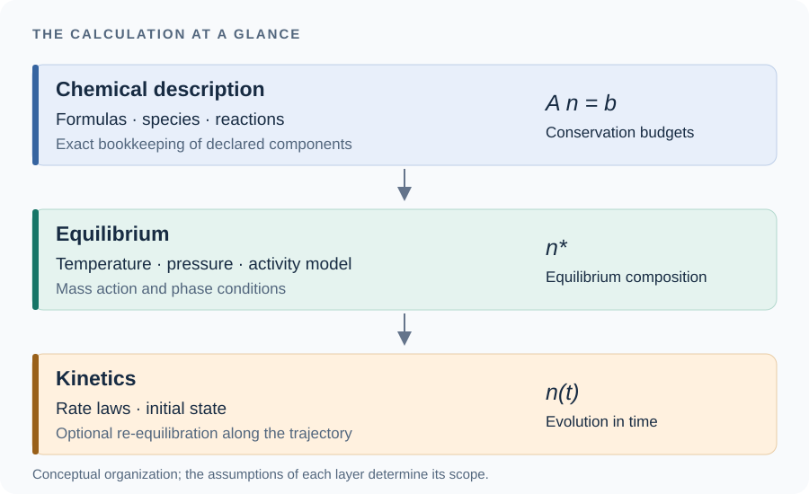

# [Theory](@id sec-theory)

This chapter answers *why this is the right calculation*, and its pages are
meant to be readable without running anything. The
[Tutorials](@ref sec-equilibrium) drive one feature at a time and the Applications
work a real case end to end; here the question is what the equations are, where
they come from, and where they stop being true.

!!! note "What belongs on a theory page, and what does not"
    These pages carry the general theory: definitions, derivations, and the
    meaning of each term. Code appears only where the correspondence between a
    formula and its implementation *is* the point — a signature, a one-line
    expression. **A theory page does not build a chemical system, does not
    solve, and does not print a table of numbers**; that is what the
    [Applications](@ref sec-app-activity-models) are for, and every quantitative
    claim made here is measured there or asserted in the test suite. The
    division exists so that there is one place to look for each kind of thing.

!!! tip "The symbols"
    Every symbol of these pages is in the [Nomenclature](@ref nomenclature), with
    its unit, and with the value the package computes with for a physical
    constant. Hovering an equation shows the symbols it holds, with their meaning
    on the page.

## The three layers, and what each one assumes

ChemistryLab computes in three layers, and almost every surprise comes from a
layer's assumptions being carried into a regime it was not built for.

| layer | what it computes | what it assumes |
|:--|:--|:--|
| **chemical description** | formulas, species, reactions, the conservation matrix | nothing physical — this is bookkeeping, and it is exact |
| **equilibrium** | a composition satisfying mass-action and phase conditions; a global Gibbs minimum for a consistent convex potential | prescribed temperature and pressure by default, well-mixed declared phases, ideal molar volumes, and an **activity model** |
| **kinetics** | a trajectory in time, optionally re-equilibrating the solution at every step | a rate law per reaction, and that the rate law's arguments are available |

*The three layers organize the calculation. Each layer adds assumptions to the
chemical bookkeeping; kinetic calculations can optionally re-equilibrate the
solution as the reaction progresses.*

The activity model is where the second layer stops being ideal, so it is the
first thing to read and the first thing to suspect:
[Activity models](@ref sec-theory-activity).

## Reading order

The chapter can be read in two ways, and the first is short.

### A first reading

These pages answer, in order, the questions a reader new to thermodynamics asks
about what the package computes on a cement. Each opens with the questions it
answers.

1. [The two laws, and what the Gibbs energy measures](@ref sec-theory-laws)
   rebuilds the enthalpy a calorimeter measures and the Gibbs energy the solver
   minimizes, and says what each is not: ``\Delta H`` and ``T\Delta S`` are
   not two flows of heat, and a kinetic history is not a state function.
2. [The chemical potential and reactions](@ref sec-theory-basics) lets the
   composition change: the chemical potential, why the activity of water is
   tied to those of the solutes, the Gibbs energy of a reaction as a slope, the
   equilibrium constant, and why a metastable state is not a local minimum of
   ``G``.
3. [Activity models](@ref sec-theory-activity), §1 to §3: where the activity of
   an ion comes from, and why the water activity cannot be chosen separately.
4. [The water budget of a hydrating paste](@ref sec-theory-water-budget): what
   a Gibbs minimization predicts about a hydrating paste, and what it cannot.

### For further reading, and for reference

[Formation quantities and the database](@ref sec-theory-formation) completes
the foundations with what a database stores: energies of formation, absolute
and conventional entropies, how these are measured, and how a standard potential
is carried to any temperature and pressure, up to the apparent Gibbs energy the
package reads. [Thermochemistry](@ref sec-theory-thermo) follows, since it
fixes the notation of the whole chapter, which is that of the code, and
[Standard states](@ref sec-theory-standard-states) completes it by stating what
each activity is measured from. [Proving that an answer is the answer](@ref sec-theory-certificate)
then explains why an equilibrium computed here can be checked rather than
trusted: the optimality conditions can be audited on any composition, they are
sufficient for a global minimum when the activities derive from one convex
energy, and the certificate says whether they do. The same page fixes the
meaning of stable, metastable and partial equilibrium, on which the kinetic
chapters rely.

The places where a mixture stops being ideal follow.
[Activity models](@ref sec-theory-activity) treats the aqueous phase, on which
every equilibrium depends whether or not it is mentioned, and
[Solid solutions](@ref sec-theory-solid-solutions) a solid of variable
composition. [Oxidation state](@ref theory-redox) adds the conserved quantity
that is not an element, together with the potential conjugate to it, which no
binder containing slag can do without, and
[Chemistry that happens on a surface](@ref sec-theory-surface) uses both
preceding ideas, a site balance being written like the charge row and site
mixing like a solid solution. [Rate laws](@ref sec-theory-kinetics) leaves
equilibrium for time and gives the provenance of every parameter entering a
rate, and [Kinetics under partial equilibrium](@ref sec-theory-pe-kinetics)
joins the two: the partition between the slow reactions and the fast ones, the
differential system with its exact Jacobian, the implicit step, and the energy
balance of a calorimeter.

[The water budget of a hydrating paste](@ref sec-theory-water-budget) is the
cement-specific chapter, and the one to read if the question is why a
calculation predicts a threshold at ``w/c \approx 0.30`` where
[Powers1948](@citet) reports 0.42. It is also where the limits of a 0D framework are argued rather than
asserted.

The constraint machinery — what can be held fixed instead of ``T`` and ``P``,
and by which of two mechanisms — is described in
[Constraints other than fixed T and P](@ref sec-equilibrium-constraints), where it
sits next to the syntax for asking for it.
