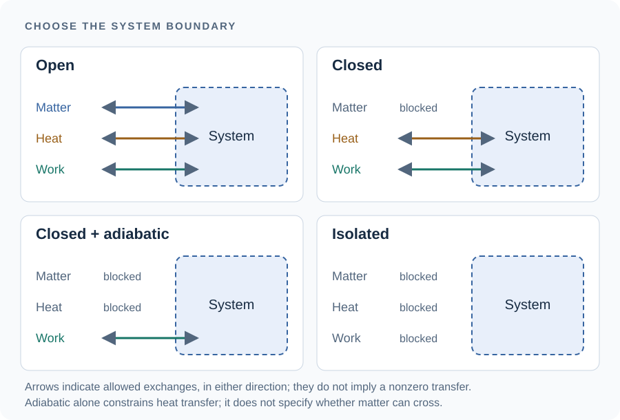

# [The two laws, and what the Gibbs energy measures](@id sec-theory-laws)

The pages of this chapter use the enthalpy, the entropy and the Gibbs energy as
familiar objects, although the relations between them are rarely obvious on a
first reading: a calorimeter measures a change of enthalpy, whereas the solver
minimizes a Gibbs energy. This page rebuilds both from the two laws of
thermodynamics, mostly in the order in which [AndersonCrerar1993](@cite)
introduce them, and writes the laws as **balances** on a chosen boundary, which
is where the conditions behind ``q_P = \Delta H`` and behind the minimum of
``G`` become explicit.
[The chemical potential and reactions](@ref sec-theory-basics) then lets the
composition change, and [Formation quantities and the database](@ref sec-theory-formation)
explains the numbers a database stores.

!!! tip "Questions this page answers"
      - Why does a calorimeter measure an enthalpy, and when does it not?
      - Why can a closed, insulated reaction heat up, and what fixes its final
        temperature?
      - What does the Gibbs energy measure, and are ``\Delta H`` and
        ``T\Delta S`` two flows of heat?
      - If ``G`` is a state function, why does the path a reaction takes
        matter?

## 1. The system and its boundary

A system is the part of the world under consideration, and its state is fixed by a few
variables, the temperature ``T``, the pressure ``P`` and the amounts ``n_i`` of
its constituents. A state function is a quantity whose value depends on the
state only, so that its change between two states does not depend on the way
followed from one to the other. Its boundary determines which transfers belong in its balance.

| description | matter crosses the boundary | heat crosses the boundary | work crosses the boundary |
|:--|:--|:--|:--|
| closed | no | allowed | allowed |
| open | allowed | allowed | allowed |
| adiabatic | depends on the boundary | no | allowed |
| isolated | no | no | no |

These descriptions can be combined: a sealed, insulated piston-cylinder is
closed and adiabatic, but can do expansion work. A sealed, insulated, rigid
vessel with no other work exchange is isolated. A sealed sample can also be
isothermal if a thermostat removes the heat of reaction.



*Arrows mark transfers that the boundary allows, in either direction. Closing
the system blocks matter transfer; adding insulation blocks heat transfer.
Work can still cross a closed adiabatic boundary, for example through a moving
piston.*

In a **closed reacting system**, the species amounts change even though no
matter crosses the boundary. For example,

```math
\mathrm{CaO + H_2O \longrightarrow Ca(OH)_2}
```

consumes lime and water and produces portlandite while conserving calcium,
hydrogen, oxygen and charge. In the package's notation the fixed quantity is
``\mathbf{A}\mathbf{n}=\mathbf{b}``, not each ``n_i`` or the sum of the species
amounts.

This is classical chemical thermodynamics: nuclear transformations, and the
contribution of exchanged energy to the mass of a sample, are outside the model.

## 2. Heat, work, and why a calorimeter measures an enthalpy

The internal energy ``U`` is a state function, whereas the heat ``q`` and the work ``w`` received by the system are not: the
same change of state can be brought about with more work and less heat, or the
reverse. The first law states that their sum is nevertheless fixed by the two
end states [AndersonCrerar1993](@cite) (§4.6),

```math
\Delta U = q + w .
```

In a chemical system held at constant pressure, the only work exchanged is
usually that of the pressure against the change of volume, ``w = -P\,\Delta V``,
and the heat received is then ``q_P = \Delta U + P\,\Delta V``. It is therefore
natural to introduce the enthalpy

```math
H = U + PV ,
```

another state function, whose change at constant pressure is exactly the heat
received, ``q_P = \Delta H``. A reaction that gives off heat at constant pressure
is one whose enthalpy decreases, and the heat recorded by an isothermal
calorimeter, counted positive when released, is ``Q = -\Delta H``. The
difference between ``\Delta H`` and ``\Delta U`` is the work ``P\,\Delta V``,
small for condensed phases and considerable as soon as a gas is produced or
consumed.

The same balance written for an infinitesimal change makes its conditions
explicit. Neglecting changes in bulk kinetic and gravitational potential
energy, the first law for a closed system reads

```math
\mathrm{d}U = \delta q - P_{\mathrm{ext}}\,\mathrm{d}V + \delta w_{\mathrm{other}}.
```

Heat and work describe transfers along a process: neither is a stored property
of the sample. This is why their infinitesimal transfers use ``\delta`` whereas
a state function uses ``\mathrm{d}``.

The pressure in expansion work is the **external** pressure. Replacing it by
the system's pressure requires mechanical equilibrium. Constant pressure alone
does not rule out electrical work, stirring or other forms of work. With
``H=U+PV``, a mechanically equilibrated closed system obeys

```math
\mathrm{d}H
= \mathrm{d}U + P\,\mathrm{d}V + V\,\mathrm{d}P
= \delta q + \delta w_{\mathrm{other}} + V\,\mathrm{d}P.
```

At constant pressure, with only pressure-volume work, this gives
``\Delta H=q_P``. With other work, the balance is instead
``\Delta H=q_P+w_{\mathrm{other}}``. A rigid closed calorimeter with no other
work measures ``\Delta U=q_V``; conversion to ``\Delta H`` requires the change
in ``PV`` and any corrections needed to refer the measurement to the stated
temperature and standard states.

An enthalpy change is an energy difference, in joules. A heat rate is an energy
transfer per unit time, in watts. Enthalpy changes can include reaction,
heating, phase change and mixing; they are not restricted to bond energies.

## [3. Heat capacity, and why an adiabatic reaction can raise the temperature](@id sec-theory-adiabatic)

The heat capacity at constant pressure measures how the enthalpy grows with
temperature at fixed composition,

```math
C_p = \left(\frac{\partial H}{\partial T}\right)_{P,n} ,
```

and it governs the other kind of calorimeter, the one that exchanges no heat.

For a closed adiabatic system at constant pressure, with only pressure-volume
work, ``H`` remains constant. For a rigid closed adiabatic system with no work,
it is ``U`` that remains constant. Neither condition requires constant
temperature.

Consider the constant-pressure case. Let the initial state have composition
``\mathbf{n}_0`` at ``T_0`` and the final state composition ``\mathbf{n}_f`` at
``T_f``. Evaluating ``H(T_f,P,\mathbf{n}_f)-H(T_0,P,\mathbf{n}_0)=0`` through an
imaginary path, first changing the composition at ``T_0`` and then heating the
final composition, gives the balance

```math
\underbrace{H(T_0,P,\mathbf{n}_f)-H(T_0,P,\mathbf{n}_0)}_{\Delta H_{\mathrm{composition}}(T_0)}
+ \int_{T_0}^{T_f} C_p(T,P,\mathbf{n}_f)\,\mathrm{d}T = 0.
```

The first term is a **difference between two compositions**, not the enthalpy
of either state alone. Both terms are total energies: ``C_p`` here is the heat
capacity of the final sample, in J/K. If a molar reaction enthalpy
``\Delta_r H`` is used, it must be integrated over the reaction extent, in moles.
Writing ``\Delta_r H+\int C_p\,\mathrm{d}T=0`` without a common amount basis
would mix J/mol and J.

An exothermic composition change makes the first term negative, and heating
can compensate it. The integral does not presume that ``T_f`` is known: this
equation determines it. If the final composition itself depends on ``T_f``,
composition and temperature must be solved together. Phase transitions along
the imaginary heating path require their enthalpy jumps as well. A vessel's
heat capacity belongs in this balance if the vessel is part of the system.

The ``C_p`` above is taken at fixed composition. A system in which some reactions
stay at equilibrium as it is heated has the larger heat capacity

```math
C_p^{\text{eq}} = C_p + \sum_r \Delta_r H \left(\frac{\partial\xi_r}{\partial T}\right)_P ,
```

the second term being the configurational heat capacity of
[Richet2001; Sec. 6.1d, Eqs. (6.10)–(6.11), p. 129](@cite), positive at a stable
equilibrium. Reactions faster than the measurement, such as the aqueous
speciation, follow the temperature; slower ones, such as the dissolution of the
clinker, do not ([Kinetics under partial equilibrium](@ref sec-theory-pe-calorimeters)).

A semi-adiabatic vessel adds the heat it loses to this balance, and it is the
subject of [A CEM I 52.5 N mortar in a semi-adiabatic calorimeter, inside the kinetics](@ref ex-semiadiabatic).

## 4. Entropy: the inequality of Clausius, and entropy production

The first law says nothing about the direction of a change. The second law
supplies it through a further state function, the entropy ``S``, which obeys, for
any transformation of a closed system at temperature ``T``, the inequality of
Clausius [AndersonCrerar1993](@cite) (§5.2, §5.8)

```math
\mathrm{d}S \;\ge\; \frac{\delta q}{T} ,
```

the equality holding for a reversible transformation only. Unlike ``U`` and
``H``, the entropy can be given a zero common to all substances, the third law
fixing it for perfect crystals at 0 K [Richet2001; Sec. 4.4b, p. 75](@cite);
[Absolute entropy and entropy of formation](@ref sec-theory-absolute-entropy)
defines it, together with the entropy of formation it must not be confused with.

The inequality becomes a balance once the entropy created inside the system is
named. For a closed system exchanging heat at a boundary temperature ``T_b``,

```math
\mathrm{d}S = \frac{\delta q}{T_b} + \mathrm{d}S_{\mathrm{gen}},
\qquad \mathrm{d}S_{\mathrm{gen}} \ge 0.
```

With several heat contacts, sum ``\delta q_k/T_{b,k}``. The denominator belongs
to the heat contact in the entropy balance; it cannot in general be replaced
by a single temperature of a sample containing thermal gradients. An
adiabatic closed system has ``\Delta S=S_{\mathrm{gen}}\ge0`` even while its
temperature changes. A closed system that exports enough entropy as heat can
have ``\Delta S<0``; the nonnegative quantity is the entropy production.

To evaluate the difference between two thermodynamic states, one may use any
**reversible reference path** connecting them:

```math
\Delta S = \int_{\mathrm{initial}}^{\mathrm{final}}
              \frac{\delta q_{\mathrm{rev}}}{T}.
```

This is a path integral of heat transfer divided by the temperature at which
each transfer occurs. For reversible heating at fixed pressure and composition,
``\delta q_{\mathrm{rev}}=C_p\,\mathrm{d}T``, so it becomes
``\int_{T_0}^{T_f} C_p/T\,\mathrm{d}T``. For an isothermal reversible path it
becomes ``q_{\mathrm{rev}}/T``. These are different parameterizations of the
same definition, not a general replacement of heat by temperature.

Entropy describes the thermodynamic availability of energy and the possible
microscopic states. Reading it as disorder is a useful picture, but the picture
alone does not establish a balance or the sign of a reaction entropy. The
distinction between conservation and direction is developed in
[AndersonCrerar1993](@cite), Chapter 5.

## [5. The Gibbs energy, and what it measures](@id sec-theory-gibbs-criterion)

At constant pressure, with no work other than that of the pressure, the heat
received is the change of enthalpy, ``\delta q = \mathrm{d}H`` (§2), and the
inequality becomes ``\mathrm{d}H - T\,\mathrm{d}S \le 0``. At constant
temperature the left-hand side is the differential of one function,
``\mathrm{d}(H - TS) = \mathrm{d}H - T\,\mathrm{d}S - S\,\mathrm{d}T
= \mathrm{d}H - T\,\mathrm{d}S``. It is thus the function

```math
G = H - TS ,
```

the Gibbs energy, that can only decrease in a spontaneous transformation at fixed
``T`` and ``P``, ``\mathrm{d}G \le 0``, and reaches its minimum at equilibrium.
This is the principle the solver of this package implements.

The derivation holds under stated constraints, and the entropy balance of §4
shows which. ``G = H - TS`` is defined at each state, and its existence does
not require the temperature to remain constant along a process; the minimum
criterion does. For a closed system whose initial and final states share the
temperature ``T`` of one heat reservoir and the same imposed pressure, with
only pressure-volume work, the entropy balance applied to the system and the
reservoir reads

```math
\Delta G=\Delta H-T\Delta S_{\mathrm{system}}
=-T\Delta S_{\mathrm{universe}}\le0,
\qquad q_P=\Delta H .
```

Equilibrium minimizes ``G`` over the allowed compositions at fixed ``T``,
``P`` and conservation budget. Other boundaries give other criteria: an
isolated rigid system maximizes ``S`` at fixed ``U``, ``V`` and budget, and an
adiabatic constant-pressure system with only pressure-volume work maximizes
``S`` at fixed ``H``, ``P`` and budget.

What vanishes at equilibrium is a slope, not a difference. The Gibbs energy of
every reaction that can proceed both ways,
``\Delta_r G = (\partial G/\partial\xi)_{T,P}``, is zero there; at a boundary,
such as an absent pure phase, only the feasible direction is tested and an
inequality replaces that equality. The difference ``\Delta G`` between an
initial state and the equilibrium state is negative, and ``G`` itself has no
reason to take any particular value. The distinction is drawn, with the extent
of reaction ``\xi`` it requires, in
[The Gibbs energy of a reaction is a slope, not a difference](@ref sec-theory-reaction-gibbs).

What ``G`` measures is a capacity for work. In a reversible change at fixed
``T`` and ``P``, a system can deliver work other than that of its expansion, the
electrical work of a battery for instance, and the most it can deliver is
``-\Delta G``; a change that delivers none, as a reaction in a beaker does,
dissipates that capacity as heat instead. The two terms of ``G`` weigh two tendencies against each other: a change
releasing heat lowers ``H``, and a change raising the entropy of the system
lowers ``-TS``. A reaction that absorbs heat, ``\Delta H > 0``, can therefore
still proceed at fixed ``T`` and ``P`` when the entropy of the system grows by
more than ``\Delta H/T``, the entropy that comes in with the heat drawn from the
surroundings, as in the dissolution of many salts; the excess,
``\Delta S - \Delta H/T = -\Delta G/T``, is the entropy the reaction produces
[Richet2001; Sec. 2.3d, Eqs. (2.35)–(2.37), pp. 35–36](@cite).

### Why ``\Delta H`` and ``T\Delta S`` are not two flows of heat

The two terms are easily read as two heats, one chemical and one thermal. They
are not.

At fixed ``T`` and ``P``, a reversible process can deliver useful work in
addition to expansion work. Then ``q_{\mathrm{rev}}=T\Delta S`` and the first
law gives

```math
w_{\mathrm{other,rev}}=\Delta H-q_{\mathrm{rev}}=\Delta G.
```

With the received-work convention, the maximum useful work **delivered** is
``-\Delta G``. In a process with no useful work extraction, ``q_P=\Delta H``
instead, and irreversibility accounts for the difference from
``T\Delta S``. These statements concern different processes between the same
states. They do not split the actual heat into a "chemical" contribution
``\Delta H`` and a separate "thermal" contribution ``T\Delta S``.

### The natural variables of ``G``, and the Gibbs-Helmholtz relation

For a closed system of fixed composition with only the work of the pressure,
the first law combined with the second, ``\delta q_{\rm rev} = T\,\mathrm{d}S``,
gives along a reversible change ``\mathrm{d}U = T\,\mathrm{d}S - P\,\mathrm{d}V``
[Richet2001; Sec. 2.1, Eq. (2.4), p. 27](@cite). Differentiating
``G = U + PV - TS`` and inserting it,

```math
\mathrm{d}G = \mathrm{d}U + P\,\mathrm{d}V + V\,\mathrm{d}P - T\,\mathrm{d}S - S\,\mathrm{d}T
  = -S\,\mathrm{d}T + V\,\mathrm{d}P ,
\qquad
\left(\frac{\partial G}{\partial T}\right)_P = -S .
```

The terms in ``\mathrm{d}S`` and ``\mathrm{d}V`` cancel: subtracting ``TS`` and
adding ``PV`` exchanges the variables ``S`` and ``V`` for ``T`` and ``P``: no
apparatus holds the entropy fixed, and the volume of a condensed phase only with
difficulty, whereas a thermostat and a vessel open to the atmosphere set the
temperature and the pressure [Richet2001; Sec. 2.3d, p. 36](@cite). This exchange is called
a Legendre transform [AndersonCrerar1993](@cite) (§5.4), and it is why ``G`` is the natural potential of a
system held at fixed temperature and pressure. Since ``G``, ``S`` and ``V`` are
state functions, the result holds for any change between two states, reversible
or not.

The temperature derivative of ``G/T`` follows by the rule for a quotient, and
eliminates the entropy:

```math
\left(\frac{\partial (G/T)}{\partial T}\right)_P
  = \frac{1}{T}\left(\frac{\partial G}{\partial T}\right)_P - \frac{G}{T^2}
  = -\frac{TS + G}{T^2}
  = -\frac{H}{T^2} .
```

This is the Gibbs-Helmholtz relation, by which the enthalpy, the quantity
calorimetry measures, is read on the temperature dependence of the Gibbs energy,
the quantity equilibrium depends on. Applied to a reaction it becomes the van 't
Hoff relation of [The heat of reaction](@ref sec-theory-heat-of-reaction):
measuring how an equilibrium constant changes with temperature gives the heat of the reaction without a calorimeter.

## 6. State functions and kinetic paths

A state includes temperature, pressure, composition and phase information.
Two histories reaching exactly the same initial and final states have the same
``\Delta H`` and ``\Delta G``. If one history's heating triggers a different
reaction and a different final composition, its final state is different and
so can be its state-function differences.

At an observation time, a hydrating paste retains slowly reacting clinker and
may contain phases whose formation or conversion is inhibited. The coupling
of [Kinetics under partial equilibrium](@ref sec-theory-pe-partition) integrates the slow
amounts and re-equilibrates the remaining budget. It computes successive
**partial equilibria**, not thermal jumps over molecular activation barriers.
Rate laws supply the time dependence, and a thermal balance supplies a changing
temperature when that is modeled.

A state held back by a slow transformation is often pictured as a local
minimum of ``G``; [Metastable does not mean a local minimum of G](@ref sec-theory-metastable)
explains why it is better described as the minimum of ``G`` on a smaller set
of compositions.

### [What the package counts as heat](@id sec-theory-heat-output)

For a closed isothermal constant-pressure sample with only pressure-volume
work, the heat released up to time ``t``, counted positive as in §2, is

```math
Q(t)=H(T,P,\mathbf{n}_0)-H(T,P,\mathbf{n}(t)),
\qquad
\dot Q=-\frac{\mathrm{d}H}{\mathrm{d}t}.
```

The rate depends on the trajectory; the cumulative value depends on the two
states actually reached. Changing temperature, matter transfer or other work
requires the corresponding balance terms. In particular, an adiabatic
temperature rise is not an outward heat transfer.

The package evaluates ``H=\sum_i n_i\,\Delta_a H_i^\circ`` with
[`enthalpy`](@ref): the standard enthalpies of the species, without the excess
enthalpies of the aqueous or solid-solution activity models, as
[Activity, and the enthalpy of a mixture](@ref sec-theory-mixture-enthalpy)
explains. Using a non-ideal activity model for equilibrium therefore does not
by itself add its heat of mixing to the reported calorimetry. For a
concentration-based activity, the temperature derivative behind an excess
enthalpy also includes the thermal expansion of the solution, which changes
molarity but not molality.

[`heat_release`](@ref) differences this enthalpy between two certified
speciations on the same conserved budget, so it counts the precipitation of
hydrates as well as the dissolution of the clinker. In a kinetic run, the heat
of [`cumulative_heat`](@ref) depends on the formulation. When the kinetic
reactions themselves produce the hydrates, it is [`heat_rate`](@ref), summed
over those reactions. Under **partial equilibrium** the kinetic reactions only
release ions, so the run instead balances ``H`` over the whole composition, the
equilibrium part included, its state carrying the change of the enthalpy of the
cell ([Kinetics under partial equilibrium](@ref sec-theory-pe-kinetics)), and
refuses a system in which a species has no enthalpy of formation;
[`missing_enthalpy`](@ref) lists such species. Its heat is then the one
[`heat_release`](@ref) computes from the certified replay.

Waiting longer does not by itself guarantee a unique observed assemblage.
Accessibility of transformations, boundary conditions, the species list and
possible degeneracy of equilibrium all matter. The distinction between
physical metastability, a constrained equilibrium and numerical stationarity
is developed in [Proving that an answer is the answer](@ref sec-theory-certificate).

## Where to go next

[The chemical potential and reactions](@ref sec-theory-basics) is the next
page: it lets the composition of the system change, which brings in the
chemical potential, and arrives at the equilibrium constant of a reaction.

  - [CEM I 52.5 N and slag in an isothermal calorimeter, read off the states](@ref sec-example-isothermal)
    and [A CEM I 52.5 N mortar in a semi-adiabatic calorimeter, inside the kinetics](@ref ex-semiadiabatic),
    the two calorimeters of §2 and §3 on a cement.
